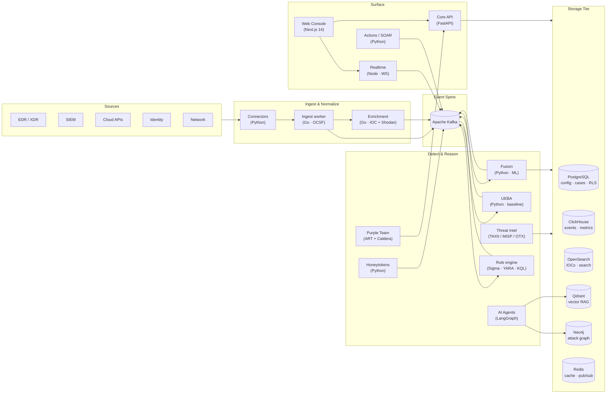

<div align="center">


# AiSOC

An open-source, self-hostable AI SOC. The agent's prompts, tool calls, and rationale are logged step-by-step and replayable. MIT-licensed.

[](https://opensource.org/licenses/MIT)
[](apps/docs/docs/benchmark.md)
[](CONTRIBUTING.md)
[](CHANGELOG.md)

[Live demo](https://tryaisoc.com) · [How AiSOC compares](#how-aisoc-compares) · [Public eval harness](apps/docs/docs/benchmark.md) · [Deployment options](#deployment-options) · [Architecture](#architecture) · [Docs](apps/docs/)

<sub>The demo at <a href="https://tryaisoc.com">tryaisoc.com</a> is a self-hosted instance fronted by a Cloudflare Tunnel — when it's reachable, the stack is running locally on a maintainer's box. It can therefore go offline at any time. To run your own (in 3.5 min, with seeded data), see <a href="#one-shot-demo">One-shot demo</a>; to expose your own instance on your own domain via Cloudflare Tunnel, see <a href="#public-demo-on-your-own-domain">Public demo on your own domain</a>.</sub>

</div>

---

## What AiSOC is

AiSOC is a single self-hostable stack that ingests security events, correlates them, runs AI-driven investigation, and surfaces the result in a SOC console. The agent and the substrate are MIT-licensed, so you can read, fork, or replace either of them.

Three properties distinguish it from closed-source AI SOC vendors:

1. **Agent decisions are logged.** The Investigation Ledger stores the LLM prompt, the response, the evidence cited, and the downstream tool calls for every step of every run. Replays are available later.
2. **The substrate has a public eval harness in CI.** Four suites gate every PR targeting `main` / `develop`: a 200-incident synthetic dataset drives the MITRE-tactic, investigation-completeness, and response-quality gates, and a separately generated 1,000-alert noisy stream drives the alert-reduction gate. Alert reduction is a real measurement against that fixed stream; the other three are substrate self-consistency gates over deterministic templates. The [benchmark page](apps/docs/docs/benchmark.md) explains exactly which is which.
3. **It runs entirely on your infrastructure.** No callbacks to a vendor cloud and no data exfiltration for "model improvement."

The orchestrator is a ~600-line LangGraph in [`services/agents/`](services/agents/). It is small enough to read end-to-end, swap models in, and patch.

---

## How AiSOC compares

| Capability | AiSOC | Wazuh | Splunk ES | Closed-source AI SOC |
|---|---|---|---|---|
| Open-source license | MIT | GPL-2 | proprietary | proprietary |
| Self-hostable | yes | yes | enterprise-only | cloud-only |
| Autonomous AI investigation | LangGraph | no | partial (Splunk AI) | yes |
| Agent decision audit trail | public Investigation Ledger | n/a | n/a | not published |
| Public substrate eval harness | CI-gated, reproducible | n/a | n/a | not published |
| Detection content | 800 native + 6,000+ imported (Sigma / Splunk / Chronicle / CAR) | 1,200+ rules | 1,000+ apps | curated |
| Plugin SDK | Python / TypeScript / Go | YAML rules only | apps | proprietary |
| Data residency | your infra | your infra | partial | vendor cloud |
| Pricing | $0 (self-host) | $0 (self-host) | per ingest GB | enterprise |

Closed-source AI SOC vendors ship working products. AiSOC's contribution is making the agent itself open, the per-step decision trail readable, and the substrate gated by a public eval harness on every PR targeting `main` / `develop`.

---

## Deployment options

Each target ships a tested config in [`infra/`](infra/):

| Platform | Status | Config | Notes |
|---|---|---|---|
| Fly.io | first-class | [`infra/fly/`](infra/fly/) | 4 apps, ~$14/mo. See [infra/fly/README.md](infra/fly/README.md). |
| Render | supported | [`infra/render/render.yaml`](infra/render/render.yaml) | Sleep-on-idle, hobbyist tier. |
| Railway | supported | [`infra/railway/railway.toml`](infra/railway/railway.toml) | PaaS, pay-as-you-go. |
| Coolify | supported | [`docker-compose.yml`](docker-compose.yml) | Self-hosted on your own VPS. See [infra/coolify/README.md](infra/coolify/README.md). |
| Kubernetes / Helm | first-class | [`infra/helm/`](infra/helm/) | `helm install aisoc ./infra/helm/aisoc` |
| AWS / Terraform | first-class | [`infra/terraform/`](infra/terraform/) | `cd infra/terraform && terraform apply` |

The Render, Railway, and Coolify configs deploy the lean demo profile: api, agents, web, realtime, Postgres, and Redis. ClickHouse, Kafka, OpenSearch, Neo4j, and Qdrant are gated behind compose profiles. For a production-grade install with the full storage tier, use Helm or Terraform.

---

## Use it from Claude, Cursor, or Cody

AiSOC ships an [MCP server](https://modelcontextprotocol.io) so analysts can query alerts, run agent investigations, and replay every step the agent took without leaving the IDE or chat.

```bash
# Claude Desktop / Cursor / Continue / Cody
npx -y @aisoc/mcp install --host claude \
  --aisoc-url https://aisoc.your-company.com \
  --api-key  aisoc_pat_xxxxxxxxxxxx
```

The server exposes 11 tools — discovery (`aisoc_list_alerts`, `aisoc_list_cases`, `aisoc_query_detections`), deep-dive (`aisoc_get_case`, `aisoc_get_investigation`), and the action/replay set (`aisoc_run_investigation`, `aisoc_replay_decision`, `aisoc_explain_step`) for walking the agent decision ledger step-by-step.

Full guide: [docs/integrations/mcp](apps/docs/docs/integrations/mcp.md). Source: [`services/mcp/`](services/mcp/). npm: `@aisoc/mcp`.

---

## What's in the box

AiSOC bundles the components a SOC normally pieces together from separate vendors:

- **Ingest** events from any connector (CrowdStrike, Splunk, AWS, Okta, Sentinel) into a Kafka spine.
- **Correlate** them in real time with deduplication, ML scoring, and Sigma/YARA detection.
- **Enrich** every signal with threat intelligence from TAXII 2.1, MISP, OTX, and CISA KEV.
- **Reason** about attacks via a LangGraph multi-agent system grounded in MITRE ATT&CK.
- **Detect deviations** with UEBA — per-user behavioural baselines and Z-score anomaly scoring.
- **Trap adversaries** with HMAC-signed honeytokens (URLs, files, AWS credentials, emails).
- **Validate coverage** with automated Atomic Red Team and Caldera adversary emulation.
- **Respond** with blast-radius-aware SOAR actions, every step explainable.
- **Govern** with multi-tenant RLS, granular RBAC, immutable audit logs, and SOC 2 / ISO 27001 / NIST CSF / PCI-DSS / HIPAA / DORA evidence dashboards.

Everything ships under MIT. Fork it, self-host it, audit it, extend it.

---

## Highlights

<table>
<tr>
<td valign="top" width="50%">

### Real-time fusion
- Kafka spine with sub-second ingestion
- Bloom-filter dedup on 10M+ IOCs
- LightGBM + Isolation Forest scoring
- Live WebSocket feed into the console

### AI Copilot
- LangGraph agents with persistent memory
- Qdrant RAG over MITRE ATT&CK + tenant data
- Natural-language threat hunts
- Every decision traceable end-to-end

### Knowledge graph
- Neo4j entity graph (hosts, users, alerts, IOCs)
- Attack-path reconstruction per case
- Blast-radius gating on automated actions

### UEBA
- Per-user Welford online baseline (no batch jobs)
- Z-score anomaly scoring with peer-group analysis
- Kafka integration: `security.events` → `security.anomalies`
- Feeds directly into ML fusion scoring

</td>
<td valign="top" width="50%">

### Detection engineering
- Sigma over OpenSearch + ClickHouse
- YARA file/memory scanning
- KQL, EQL, Lucene, regex query types
- Community detection catalog with one-click install

### Honeytokens
- HMAC-SHA256 signed tokens (URL, file, AWS key, email)
- First-touch webhook alerting
- Token lifecycle: active / triggered / expired
- Built-in lure URL copy and share

### Purple Team
- Atomic Red Team YAML parser + Caldera executor
- ATT&CK coverage heatmap (tactic × technique)
- Detection reporting (true positive / false negative)
- Tabletop exercise session manager

### Governance
- SAML 2.0 + OIDC SSO
- Multi-tenant Postgres RLS
- Granular RBAC (`resource:action` permissions)
- Immutable audit log with tamper-proof trigger
- SOC 2, ISO 27001, NIST CSF, PCI-DSS, HIPAA, DORA dashboards
- MTTD / MTTR / MTTC SLA tracking

</td>
</tr>
</table>

---

## Architecture



### Service map

| Service | Lang | Port | Role |
|---|---|---|---|
| `web` | Next.js 14 + React | 3000 | SOC console + marketing landing |
| `api` | Python · FastAPI | 8000 | Alerts, cases, RBAC, graph, rules, audit, compliance |
| `realtime` | Node.js · `ws` | 8086 | Per-channel WebSocket fan-out |
| `agents` | Python · LangGraph | 8001 | Multi-agent reasoning + Qdrant RAG |
| `fusion` | Python | 8003 | Dedup + ML scoring (LightGBM, IsoForest) |
| `actions` | Python | 8002 | SOAR with blast-radius gating |
| `threatintel` | Python | 8005 | TAXII / MISP / OTX / KEV polling |
| `ueba` | Python | 8007 | User & Entity Behavior Analytics |
| `honeytokens` | Python | 8008 | Honeytoken lifecycle + webhook alerting |
| `purple-team` | Python | 8006 | Atomic Red Team + Caldera + ATT&CK heatmap |
| `ingest` | Go | 8081 | OCSF normalization + Shodan/CVE |
| `enrichment` | Go | 8080 | IOC enrichment (VT, AbuseIPDB, GreyNoise) |

### Storage tier

| Store | Purpose |
|---|---|
| PostgreSQL | Tenants, users, cases, detection rules, RBAC, audit log, compliance · Row-level security |
| ClickHouse | High-cardinality event analytics + alert metrics |
| OpenSearch | Full-text IOC + actor + report search · Sigma backend |
| Qdrant | Vector RAG for agents, semantic ATT&CK lookup |
| Neo4j | Knowledge graph: entities, attack paths, blast radius |
| Redis | Cache, pub/sub, IOC bloom filter, enrichment TTL |
| Kafka | Event streaming spine (raw, fused, vulnerability, anomaly, action) |

---

## Console tour

The console fuses the analyst's day-zero workflow into one surface:

- **Dashboard** — KPI tiles, trend chart, and a WebSocket-driven event ticker.
- **Alerts & Cases** — triage queues, status workflow, evidence timeline.
- **Investigation Ledger** — replayable, step-by-step record of every prompt, tool call, and rationale the agent emitted on a case.
- **Attack Graph** — Cytoscape + fcose layout over the Neo4j subgraph for a case.
- **MITRE Heatmap** — coverage tiles with per-tactic technique density.
- **Threat Hunting** — Sigma / KQL / YARA editor with on-demand hunts.
- **Detection Rules** — Monaco-powered rule builder with Sigma autocompletion.
- **Detection Catalog** — community Sigma rules with one-click tenant install.
- **Threat Intel** — IOC search, feed status, and STIX / MISP source health.
- **Marketplace** — plugins, playbooks, and detections, with ratings, badges, and category filters.
- **Playbooks** — community and private playbooks with SOAR automation.
- **UEBA** — behavioural anomaly feed and peer-group deviation chart.
- **Honeytokens** — create lures, view trigger log, copy lure URLs.
- **Purple Team** — ATT&CK heatmap, execution tracker, tabletop sessions.
- **Compliance** — SOC 2 / ISO 27001 / NIST CSF / PCI-DSS / HIPAA / DORA evidence.
- **SLA Dashboard** — MTTD, MTTR, MTTC metrics + breach alerts.
- **Audit Log** — immutable, paginated, tenant-scoped event history.
- **Benchmark** — public eval harness (alert-reduction measurement plus three substrate self-consistency gates), run in CI.
- **Settings → RBAC** — roles, permissions, and user-role assignments.
- **Ambient Copilot** — context-aware next-action suggestions on alert, case, rule, and playbook pages. Each suggestion runs the right tool with the right payload.
- **AI Copilot dock** — slide-over invoked with `⌘J` for any page.
- **Command palette** — global `⌘K` for navigation, quick actions, and Copilot.

### Responder PWA

A separate, installable PWA route at `/responder/*` for analysts who carry a pager:

- **Passkey login** — WebAuthn / FIDO2 platform authenticators only, no SMS fallback.
- **On-call view** — current responder per tenant, surfaced in alerts on the desktop console too.
- **Approvals queue** — long-lived approval requests for blast-radius-gated SOAR actions, signed off with a hardware-attested passkey.
- **Push notifications** — VAPID-signed Web Push delivered through `services/realtime`, following the on-call rotation.
- **Offline shell** — service worker + cached app shell so the responder surface keeps loading on a flaky carrier link.

See [`apps/web/src/app/(responder)/`](apps/web/src/app/(responder)/) and [`services/api/migrations/009_responder_pwa.sql`](services/api/migrations/009_responder_pwa.sql).

The marketing landing lives at `/` and the console at `/dashboard`. Both share the same brand tokens.

---

## Quick start

### One-shot demo

To see AiSOC investigate a seeded case in your browser:

```bash
git clone https://github.com/beenuar/AiSOC.git
cd AiSOC
pnpm aisoc:demo
```

That command pulls prebuilt images from `ghcr.io/beenuar/*`, brings up the slim demo profile (postgres, redis, kafka, api, agents, realtime, web), seeds canonical demo data, runs an AI investigation against a seeded case, and opens your browser at `/cases/<uuid>`.

Approximate timings on a warm Docker daemon:

| Step | Time |
|---|---|
| `docker compose pull` | ~90s |
| `docker compose up` + healthchecks | ~60s |
| Seed canonical data | ~30s |
| Kick off investigation | ~30s |
| Total | ~3.5 min |

When you're done: `pnpm aisoc:demo:down` (deletes the demo volumes).

The full development quick start with all services (UEBA, Honeytokens, Purple Team, ClickHouse, OpenSearch, Neo4j, Qdrant) is below.

### Public demo on your own domain

The same demo stack can be reached from the public internet without exposing
ports, opening firewall rules, or paying for a cloud VM. AiSOC ships a
Cloudflare Tunnel template plus a wrapper script that:

1. Brings up the slim demo profile via `pnpm aisoc:demo --no-open` (Postgres, Redis, Kafka, api, agents, realtime, web).
2. Creates a named `cloudflared` tunnel (or reuses one if it already exists).
3. Renders an ingress config from [`infra/cloudflare/config.yml.example`](infra/cloudflare/config.yml.example) into `~/.cloudflared/<tunnel-name>.yml`, after validating it with `cloudflared tunnel ingress validate`.
4. Adds DNS routes on your zone so the apex (`https://<your-domain>`) and the `api`, `ws`, `docs` subdomains all resolve to the tunnel.
5. Runs `cloudflared tunnel run` in the foreground (Ctrl+C exits cleanly; the local stack keeps running).

The result: a publicly reachable, fully self-hosted SOC console, served from
your laptop, accepting only traffic that came in through Cloudflare. No
inbound ports are opened on your router or firewall.

#### Prerequisites

- A domain whose DNS is managed by Cloudflare.
- The [`cloudflared`](https://developers.cloudflare.com/cloudflare-one/connections/connect-networks/get-started/) CLI installed locally (`brew install cloudflared` on macOS).
- One of two auth methods (the script accepts either):
  - **(A) Origin-cert flow:** run `cloudflared tunnel login` once on this machine — it drops a `cert.pem` in `~/.cloudflared/` that authorises this host to manage tunnels and DNS records on the zone. The script will then create the tunnel, render the ingress config, and wire DNS automatically.
  - **(B) Tunnel-token flow ★:** create a tunnel in the Cloudflare Zero Trust dashboard (Networks → Tunnels → *Create a tunnel* → Cloudflared), configure the four public hostnames (apex/api/ws/docs → `localhost:3000/8000/8086/3001`), and copy the `--token ey…` value the dashboard hands you. No `cert.pem` required, no local DNS plumbing. Useful when the browser-based `cloudflared tunnel login` won't write a cert (corporate browsers, headless boxes, etc).

#### Run it

```bash
# (A) Origin-cert flow — script manages tunnel, ingress, and DNS:
pnpm demo:public                         # default: tryaisoc.com
DOMAIN=demo.example.com pnpm demo:public # any zone you control

# (B) Tunnel-token flow — dashboard owns the tunnel, ingress, and DNS:
export CLOUDFLARE_TUNNEL_TOKEN='ey…'     # paste the token from the dashboard
pnpm demo:public                         # script auto-detects the token

# Already have the local stack running? Just bring the tunnel up:
pnpm demo:public:tunnel-only             # works for both auth modes

# Just provision the tunnel + DNS, but don't run cloudflared
# (origin-cert flow only — useful before `cloudflared service install`
# to leave it running 24/7):
SKIP_RUN=1 pnpm demo:public:setup
```

All env vars are forwarded to [`infra/cloudflare/tunnel.sh`](infra/cloudflare/tunnel.sh):
`DOMAIN` (apex, default `tryaisoc.com`), `TUNNEL_NAME` (default `aisoc-tryaisoc`,
ignored in token mode), `SUBDOMAINS` (default `"api ws docs"`, ignored in token
mode), `SKIP_DNS=1` (don't touch DNS records), `SKIP_RUN=1` (set up everything
but don't run the tunnel), and `CLOUDFLARE_TUNNEL_TOKEN` (switch to flow B).
Run `bash scripts/demo-public.sh --help` to see the full set, or read
[`infra/cloudflare/README.md`](infra/cloudflare/README.md) for the topology
diagram and production-hardening notes (running `cloudflared` as a launchd /
systemd service, layering Cloudflare Access in front, etc).

#### Stop it

```bash
# Ctrl-C in the tunnel terminal stops cloudflared.
# Then bring the local stack down:
pnpm aisoc:demo:down
```

The `tryaisoc.com` instance linked at the top of this README is exactly that:
this script, running from a maintainer's machine. The tunnel infra is
upstream so anyone can do the same on their own domain.

### Full stack (development)

#### Prerequisites

- Docker 24+ and Docker Compose v2
- Node.js 20+ and pnpm 8+
- Go 1.21+ and Python 3.11+ (only for local service hacking)

#### 1. Clone

```bash
git clone https://github.com/beenuar/AiSOC.git
cd AiSOC
cp .env.example .env
```

#### 2. Configure

```env
# AI providers (one required)
ANTHROPIC_API_KEY=sk-ant-...
OPENAI_API_KEY=sk-...

# Optional enrichment
CYBLE_API_KEY=...
VIRUSTOTAL_API_KEY=...
ABUSEIPDB_API_KEY=...
GREYNOISE_API_KEY=...
SHODAN_API_KEY=...

# Optional TAXII feeds
TAXII_FEEDS=https://cti-taxii.mitre.org/taxii/,enterprise-attack,,

# Optional SSO (SAML 2.0)
SAML_IDP_METADATA_URL=https://your-idp.example.com/metadata

# Optional SSO (OIDC)
OIDC_DISCOVERY_URL=https://your-idp.example.com/.well-known/openid-configuration
OIDC_CLIENT_ID=aisoc
OIDC_CLIENT_SECRET=...

# Optional Purple Team
CALDERA_URL=http://localhost:8888
CALDERA_API_KEY=...
ATOMIC_RED_TEAM_PATH=/opt/atomic-red-team/atomics
```

#### 3. Boot

```bash
docker compose up -d
docker compose ps
```

First start takes ~60s while datastores warm up.

#### 4. Seed demo data

```bash
pnpm seed:demo            # generates cases, alerts, IOCs, attack paths, UEBA anomalies
```

#### 5. Verify

```bash
pnpm aisoc:doctor         # health check: ports, containers, demo data, API + WS
```

If any check fails, the doctor tells you exactly what to fix before logging in.

#### 5b. Run the public eval harness (optional)

```bash
# Run all four substrate eval suites against the bundled 200-incident
# dataset and write a machine-readable report. The dataset size is fixed by
# services/agents/tests/eval_data/synthetic_incidents.json — there is no
# --count flag.
python scripts/run_evals.py --out eval_report.json

# Or run a single eval gate
pytest services/agents/tests/test_mitre_accuracy.py
```

The harness writes `eval_report.json` and `eval_mitre_accuracy_report.json`, which the [public eval harness page](apps/docs/docs/benchmark.md) renders. The same harness runs in CI on every PR targeting `main` / `develop` — see [`.github/workflows/ci.yml`](.github/workflows/ci.yml).

The harness runs deterministic substrate code (extractors, fusion, templates, judges) against synthetic data — it does not call the live LLM agent. Three of the four metrics are substrate self-consistency gates rather than agent accuracy scores. The [benchmark page](apps/docs/docs/benchmark.md) documents what each suite measures and what it does not.

#### 6. Open

| Surface | URL | Notes |
|---|---|---|
| Marketing | http://localhost:3000 | Public landing page |
| Console | http://localhost:3000/dashboard | Default user: `admin@aisoc.local` / `changeme` |
| API (Swagger) | http://localhost:8000/docs | REST + GraphQL endpoints |
| Agents | http://localhost:8001/docs | LangGraph runner |
| UEBA | http://localhost:8007/docs | Behavioural analytics |
| Honeytokens | http://localhost:8008/docs | Honeytoken lifecycle |
| Purple Team | http://localhost:8006/docs | Adversary emulation |
| Realtime WS | ws://localhost:8086/ws/alerts | Live alert channel |
| Neo4j | http://localhost:7474 | `neo4j` / `neo4j_dev_secret` |
| Grafana | http://localhost:3001 | `admin` / `admin` (`monitoring` profile) |
| Jaeger | http://localhost:16686 | Distributed traces (`monitoring` profile) |

#### Optional profiles

```bash
docker compose --profile connectors up -d   # CrowdStrike, Splunk, AWS, Okta, Sentinel
docker compose --profile monitoring up -d   # Prometheus, Grafana, Jaeger, OTel Collector
```

---

## Monorepo layout

```
AiSOC/
├── apps/
│   ├── web/              # Next.js 14 console + marketing landing + Responder PWA route
│   └── docs/             # Docusaurus documentation site
├── services/
│   ├── api/              # Core REST API + Neo4j graph + rule engine + auth + RBAC + compliance + ledger
│   ├── ingest/           # Go · OCSF normalization · Shodan + CVE
│   ├── enrichment/       # Go · IOC enrichment
│   ├── fusion/           # Python · dedup + ML scoring
│   ├── agents/           # Python · LangGraph + Qdrant RAG + investigation ledger writer
│   ├── actions/          # Python · SOAR + blast-radius gating
│   ├── threatintel/      # Python · TAXII / MISP / OTX / KEV
│   ├── realtime/         # Node.js · per-channel WebSocket fan-out + VAPID Web Push
│   ├── ueba/             # Python · User & Entity Behavior Analytics
│   ├── honeytokens/      # Python · deceptive credential traps
│   ├── purple-team/      # Python · Atomic Red Team + Caldera + ATT&CK
│   └── mcp/              # TypeScript · Model Context Protocol server (@aisoc/mcp)
├── integrations/         # Connector implementations (CrowdStrike, Splunk, AWS, …)
├── packages/
│   ├── types/            # Shared TS types
│   ├── ui/               # Shared React primitives
│   ├── ocsf/             # OCSF normalization helpers
│   ├── sdk-ts/           # TypeScript client SDK for AiSOC API (npm: @aisoc/sdk)
│   ├── sdk-py/           # Async Python client SDK (PyPI: aisoc-sdk)
│   ├── sdk-go/           # Go client SDK + models (module: github.com/beenuar/aisoc/sdk-go)
│   ├── plugin-sdk-ts/    # TypeScript plugin development SDK
│   ├── plugin-sdk-py/    # Python plugin development SDK (PyPI: aisoc-plugin-sdk)
│   ├── plugin-sdk-go/    # Go plugin development SDK (module: github.com/beenuar/aisoc/plugin-sdk-go)
│   └── aisoc-cli/        # CLI: scaffold / validate / publish plugins & detections
├── detections/           # Community Sigma detection rules (YAML)
├── playbooks/            # Community SOAR playbooks (YAML)
├── plugins/              # First-party plugins (Go + Python)
├── marketplace/          # Marketplace index (JSON, generated by scripts/build_marketplace.py)
├── infra/
│   ├── coolify/          # Coolify (self-hosted Heroku-style PaaS) quickstart
│   ├── fly/              # Fly.io machines + deploy script
│   ├── railway/          # Railway template (railway.toml)
│   ├── render/           # Render blueprint (render.yaml)
│   ├── terraform/        # AWS (VPC, EKS, RDS, ElastiCache, MSK)
│   └── helm/             # Kubernetes Helm chart (HPA, PDB, Ingress per service)
├── docs/
│   ├── openapi.yaml      # OpenAPI 3.1 spec
│   ├── architecture/     # System design docs
│   └── operations/       # Runbooks + multi-region guide
└── scripts/
    ├── aisoc-demo.ts     # One-shot demo orchestrator (powers `pnpm aisoc:demo`)
    ├── aisoc-doctor.ts   # Local health check
    ├── run_evals.py      # Public eval harness
    ├── generate_eval_incidents.py  # 200-incident synthetic generator
    ├── build_marketplace.py        # Build marketplace/index.json from detections+playbooks+plugins
    ├── validate_detections.py      # YAML schema validation for Sigma detections
    ├── validate_playbooks.py       # YAML schema validation for playbooks
    ├── backup.sh         # Postgres + ClickHouse + plugins → S3/R2
    ├── restore.sh        # Point-in-time restore
    └── generate_runbook.py  # Auto-generate runbooks from OTel traces
```

---

## API reference

The full OpenAPI 3.1 spec lives at [`docs/openapi.yaml`](docs/openapi.yaml). Endpoint groups:

| Tag | Prefix | Notes |
|---|---|---|
| `auth` | `/api/v1/auth/` | JWT login, SAML ACS, OIDC callback |
| `alerts` | `/api/v1/alerts/` | CRUD, bulk status, timeline |
| `cases` | `/api/v1/cases/` | Create, link alerts, evidence |
| `rules` | `/api/v1/rules/` | Sigma / YARA / KQL CRUD + test |
| `detections` | `/api/v1/detections/` | Catalog browse + install |
| `plugins` | `/api/v1/plugins/` | Registry, publish, rate, approve |
| `playbooks` | `/api/v1/playbooks/` | Community + private playbooks |
| `marketplace` | `/api/v1/marketplace/` | Plugin marketplace with filters |
| `compliance` | `/api/v1/compliance/` | SOC 2 / ISO 27001 / NIST CSF / PCI / HIPAA / DORA |
| `audit` | `/api/v1/audit/` | Immutable audit log, paginated |
| `rbac` | `/api/v1/rbac/` | Roles, permissions, user-role assignments |
| `sla` | `/api/v1/sla/` | MTTD/MTTR/MTTC metrics + breach log |
| `ueba` | `/api/v1/ueba/` | Anomaly feed + baseline stats |
| `honeytokens` | `/api/v1/honeytokens/` | Token lifecycle + trigger events |
| `purple-team` | `/api/v1/purple-team/` | Atomic tests, executions, tabletop sessions |
| `graph` | `/api/v1/graph/` | Neo4j subgraph for a case |
| `intel` | `/api/v1/intel/` | IOC search, feed status |
| `graphql` | `/graphql` | GraphQL schema (alerts, cases, intel) |

Interactive docs: `http://localhost:8000/docs` (Swagger) or `http://localhost:8000/redoc` (ReDoc).

---

## Plugin and detection SDK

The CLI is published as a Python package. Install it with `pipx` (recommended) or `pip`:

```bash
pipx install aisoc-cli            # PyPI release
# or, from the monorepo:
pip install -e packages/aisoc-cli

# Scaffold a new plugin
aisoc scaffold plugin my-connector

# Validate a detection rule
aisoc validate detection ./detections/my-rule.yaml

# Publish to community registry (Ed25519 signed)
aisoc publish plugin ./my-connector --key ~/.aisoc/signing.key
```

SDKs:

- TypeScript — `packages/plugin-sdk-ts` (npm: `@aisoc/plugin-sdk`)
- Python — `packages/plugin-sdk-py` (PyPI: `aisoc-plugin-sdk`)
- Go — `packages/plugin-sdk-go` (module: `github.com/beenuar/aisoc/plugin-sdk-go`)

Detection authors can drop YAML rules directly into `detections/` and SOAR playbooks into `playbooks/`. CI validates them on every PR ([`scripts/validate_detections.py`](scripts/validate_detections.py), [`scripts/validate_playbooks.py`](scripts/validate_playbooks.py)) and [`scripts/build_marketplace.py`](scripts/build_marketplace.py) republishes [`marketplace/index.json`](marketplace/index.json) so the in-app Marketplace picks them up automatically.

---

## Development

### Frontend

```bash
cd apps/web
pnpm install
pnpm dev
```

### Backend (selective)

```bash
docker compose up -d postgres redis kafka clickhouse opensearch qdrant neo4j

# Core API
cd services/api && poetry install && poetry run uvicorn app.main:app --reload --port 8000

# UEBA
cd services/ueba && poetry install && poetry run uvicorn app.main:app --reload --port 8007

# Honeytokens
cd services/honeytokens && poetry install && poetry run uvicorn app.main:app --reload --port 8008

# Purple Team
cd services/purple-team && poetry install && poetry run uvicorn app.main:app --reload --port 8006

# Fusion
cd services/fusion && poetry install && poetry run uvicorn app.main:app --reload --port 8003

# Go services
cd services/ingest && go run main.go
```

### Database migrations

```bash
# Run all migrations
docker compose exec api alembic upgrade head

# Per-service migrations
cd services/ueba && poetry run alembic upgrade head
cd services/honeytokens && poetry run alembic upgrade head
cd services/purple-team && poetry run alembic upgrade head
```

### Tests

```bash
cd apps/web && pnpm test
cd services/api && poetry run pytest
cd services/ueba && poetry run pytest
cd services/honeytokens && poetry run pytest
cd services/purple-team && poetry run pytest
cd services/ingest && go test ./...
```

---

## Deployment

### Kubernetes

```bash
helm repo add bitnami https://charts.bitnami.com/bitnami
helm install aisoc ./infra/helm/aisoc \
  --namespace aisoc \
  --create-namespace \
  --values ./infra/helm/aisoc/values.yaml \
  --set global.environment=production
```

The Helm chart includes HPA, PDB, and Ingress for every microservice.

### Backup and restore

```bash
# Backup Postgres + ClickHouse + plugins to S3
./scripts/backup.sh --target s3://my-bucket/aisoc-backups

# Point-in-time restore
./scripts/restore.sh --source s3://my-bucket/aisoc-backups/2026-05-03T10:00:00Z
```

### Multi-region

See [`docs/operations/multi-region.md`](docs/operations/multi-region.md) for active-passive and active-active deployment guides.

### Operational runbooks

```bash
# Auto-generate runbook from live OTel trace data
python scripts/generate_runbook.py --service api --output docs/operations/runbooks/api.md
```

### Terraform on AWS

```bash
cd infra/terraform
terraform init
terraform plan -var="environment=prod"
terraform apply
```

---

## Roadmap

The public roadmap lives in [ROADMAP.md](ROADMAP.md). The v4.1, v5.0, v5.1, and v5.2 items have shipped (Investigation Ledger, Ambient Copilot, Responder PWA, public eval harness, MCP server, and the one-shot demo). Next:

- v6.0 — Agent-authored detections with human-in-the-loop review
- v6.1 — Federated threat intel sharing across self-hosted instances
- v6.2 — Multi-region active-active with CRDTs for case sync

---

## Contributing

PRs of every size are welcome. Read [CONTRIBUTING.md](CONTRIBUTING.md) for the workflow and the [Code of Conduct](CODE_OF_CONDUCT.md) before opening a PR.

Good first issues:

- New connector integrations in `integrations/`
- Community Sigma detections in `detections/`
- New plugins published to the marketplace
- Frontend UI polish (Tailwind / React)
- Documentation and tutorials in `apps/docs/`
- Test coverage for any service
- Translations

---

## Security

For security issues, please do not open a public issue. Use [GitHub's private vulnerability reporting](https://github.com/beenuar/AiSOC/security/advisories/new). Full policy in [SECURITY.md](SECURITY.md). AiSOC follows coordinated disclosure.

---

## License

[MIT](LICENSE) — © 2024–present AiSOC contributors.

<div align="center">

[Report a bug](https://github.com/beenuar/AiSOC/issues/new?template=bug_report.md) · [Request a feature](https://github.com/beenuar/AiSOC/issues/new?template=feature_request.md) · [Contribute](CONTRIBUTING.md) · [Read the docs](apps/docs/)

</div>
