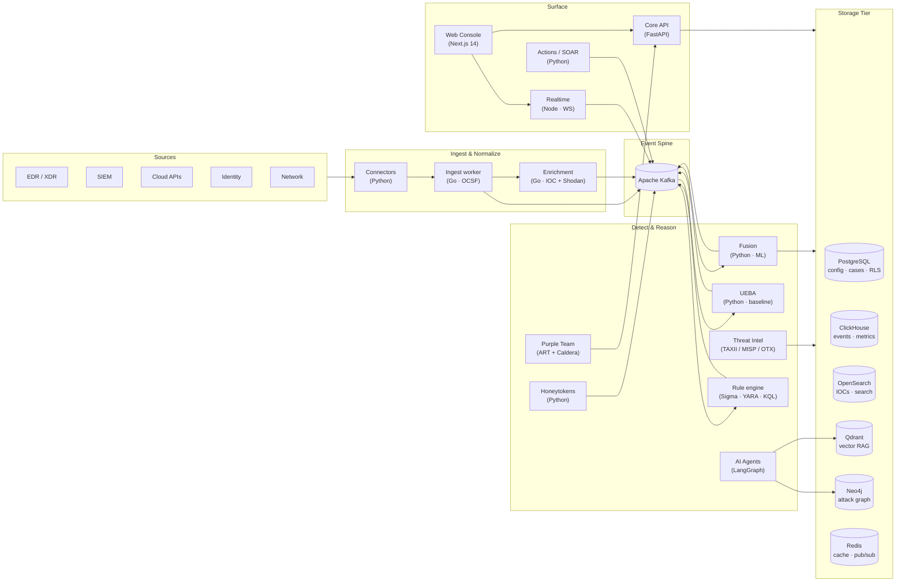

<div align="center">


# AiSOC

An open-source, self-hostable AI SOC. The agent's prompts, tool calls, and rationale are logged step-by-step and replayable. MIT-licensed.

[](https://opensource.org/licenses/MIT)
[](apps/docs/docs/benchmark.md)
[](CONTRIBUTING.md)
[](CHANGELOG.md)

[Live demo](https://tryaisoc.com) · [How AiSOC compares](#how-aisoc-compares) · [Public eval harness](apps/docs/docs/benchmark.md) · [Deploy in 60 seconds](#deploy-in-60-seconds) · [Deployment options](#deployment-options) · [Architecture](#architecture) · [Docs](apps/docs/)

<sub>The demo at <a href="https://tryaisoc.com">tryaisoc.com</a> is a self-hosted instance fronted by a Cloudflare Tunnel — when it's reachable, the stack is running locally on a maintainer's box. It can therefore go offline at any time. To run your own (in 3.5 min, with seeded data), see <a href="#one-shot-demo">One-shot demo</a>; to expose your own instance on your own domain via Cloudflare Tunnel, see <a href="#public-demo-on-your-own-domain">Public demo on your own domain</a>.</sub>

[](https://github.com/beenuar/AiSOC/topics)

</div>

---

## What AiSOC is

AiSOC is a single self-hostable stack that ingests security events, correlates them, runs AI-driven investigation, and surfaces the result in a SOC console. The agent and the substrate are MIT-licensed, so you can read, fork, or replace either of them.

Three properties distinguish it from closed-source AI SOC vendors:

1. **Agent decisions are logged.** The Investigation Ledger stores the LLM prompt, the response, the evidence cited, and the downstream tool calls for every step of every run. Replays are available later.
2. **The substrate has a public eval harness in CI.** Five suites gate every PR targeting `main` / `develop`: a 200-incident synthetic dataset drawn from 55 distinct templates drives the MITRE-tactic, investigation-completeness, and response-quality gates (each reporting both a per-case mean and a per-template macro so a single broken template can't hide behind 199 working duplicates); a separately generated 1,000-alert noisy stream drives the alert-reduction gate; and a schema/coverage gate validates `synthetic_telemetry.jsonl` — the companion corpus of ~360 backing events across 14 log sources (Sysmon, Windows Security, M365 audit, Azure sign-in, CloudTrail, Linux auditd, journald, EDR, DNS, web access, Kubernetes audit, GitHub audit, VPN, DB audit) that connector and Sigma PRs can wire against. Alert reduction is a real measurement against the fixed alert stream; the three rubric-based suites are substrate self-consistency gates over deterministic templates. The [benchmark page](apps/docs/docs/benchmark.md) explains exactly which is which.
3. **It runs entirely on your infrastructure.** No callbacks to a vendor cloud and no data exfiltration for "model improvement."

The orchestrator is a ~600-line LangGraph in [`services/agents/`](services/agents/). It is small enough to read end-to-end, swap models in, and patch.

---

## How AiSOC compares

| Capability | AiSOC | Wazuh | Splunk ES | Closed-source AI SOC |
|---|---|---|---|---|
| Open-source license | MIT | GPL-2 | proprietary | proprietary |
| Self-hostable | yes | yes | enterprise-only | cloud-only |
| Autonomous AI investigation | LangGraph | no | partial (Splunk AI) | yes |
| Agent decision audit trail | public Investigation Ledger | n/a | n/a | not published |
| Public substrate eval harness | CI-gated, reproducible, with synthetic telemetry corpus + per-template macros | n/a | n/a | not published |
| Detection content | 800 native + 6,000+ imported (Sigma / Splunk / Chronicle / CAR) | 1,200+ rules | 1,000+ apps | curated |
| Plugin SDK | Python / TypeScript / Go | YAML rules only | apps | proprietary |
| Data residency | your infra | your infra | partial | vendor cloud |
| Pricing | $0 (self-host) | $0 (self-host) | per ingest GB | enterprise |

Closed-source AI SOC vendors ship working products. AiSOC's contribution is making the agent itself open, the per-step decision trail readable, and the substrate gated by a public eval harness on every PR targeting `main` / `develop`.

---

## Deploy in 60 seconds

Three frictionless paths to a running, seeded AiSOC instance with `INC-RT-001` (the LockBit 3.0 ransomware showcase) already mid-investigation when you land on it. Each path runs `alembic upgrade head` and `python -m app.scripts.seed_demo` as part of its lifecycle, so the seeded data is present without a manual step.

### 1. Render — one click, hosted

[](https://render.com/deploy?repo=https://github.com/beenuar/AiSOC)

Render reads [`render.yaml`](render.yaml) at the repo root, provisions Postgres + Redis, and brings up the demo profile (api, agents, web, realtime). The `preDeployCommand` migrates and seeds, so the canonical `INC-RT-001` is present on first boot. Sleep-on-idle on the hobby tier; flip to standard instances for production. Demo runs deterministic-mode by default — no OpenAI/Anthropic key needed. See [`infra/render/README.md`](infra/render/README.md) for cost, scaling, and BYO-LLM details.

### 2. Docker Compose — one command, local

```bash
git clone https://github.com/beenuar/AiSOC.git && cd AiSOC && pnpm aisoc:demo
```

Pulls prebuilt `ghcr.io/beenuar/*` images, brings up the slim demo profile (Postgres, Redis, Kafka, api, agents, realtime, web), runs the seeder as a one-shot container, and opens your browser at `/cases/INC-RT-001?tab=ledger` with `demo@aisoc.dev` already auto-logged-in. Idempotent: re-running is a no-op against a seeded volume. Target on a clean Mac with a warm Docker daemon: clone-to-investigation in **~3.5 min warm / ~5 min cold**. Stop with `pnpm aisoc:demo:down`. See [One-shot demo](#one-shot-demo) for the timing breakdown and what you'll see on screen.

### 3. Fly.io — one script, hosted, persistent

```bash
git clone https://github.com/beenuar/AiSOC.git && cd AiSOC
./infra/fly/fly-demo-deploy.sh --provision  # first run: also creates Postgres + Upstash
./infra/fly/fly-demo-deploy.sh              # subsequent runs: deploys updates
```

Idempotent shell wrapper around `flyctl` that deploys four apps (api, agents, web, realtime) plus managed Postgres + Upstash Redis, wires the `*.internal` 6PN DNS between them, runs migrations + seeding as a `release_command`, and issues TLS certs for your domain. ~$14/mo at idle. **Time-to-first-investigation budget: <60s from the click**, since the seeder pre-warms a running investigation so the deeplink lands inside the TTFI budget regardless of cold-start. See [`infra/fly/README.md`](infra/fly/README.md) for DNS prerequisites and per-app sizing.

> **Production-grade install?** Skip the demo paths above and use [`infra/helm/`](infra/helm/) (Kubernetes) or [`infra/terraform/`](infra/terraform/) (AWS). Both bring up the full storage tier — ClickHouse, Kafka, OpenSearch, Neo4j, Qdrant — gated behind compose profiles in the demo paths above.

---

## Deployment options

Each target ships a tested config in [`infra/`](infra/):

| Platform | Status | Config | Notes |
|---|---|---|---|
| Fly.io | first-class | [`infra/fly/`](infra/fly/) | 4 apps, ~$14/mo. See [infra/fly/README.md](infra/fly/README.md). |
| Render | supported | [`render.yaml`](render.yaml) + [`infra/render/`](infra/render/) | Sleep-on-idle, hobbyist tier. One-click via blueprint button. |
| Railway | supported | [`infra/railway/railway.toml`](infra/railway/railway.toml) | PaaS, pay-as-you-go. |
| Coolify | supported | [`docker-compose.yml`](docker-compose.yml) | Self-hosted on your own VPS. See [infra/coolify/README.md](infra/coolify/README.md). |
| Kubernetes / Helm | first-class | [`infra/helm/`](infra/helm/) | `helm install aisoc ./infra/helm/aisoc` |
| AWS / Terraform | first-class | [`infra/terraform/`](infra/terraform/) | `cd infra/terraform && terraform apply` |

The Render, Railway, and Coolify configs deploy the lean demo profile: api, agents, web, realtime, Postgres, and Redis. ClickHouse, Kafka, OpenSearch, Neo4j, and Qdrant are gated behind compose profiles. For a production-grade install with the full storage tier, use Helm or Terraform.

---

## Use it from Claude, Cursor, or Cody

AiSOC ships an [MCP server](https://modelcontextprotocol.io) so analysts can query alerts, run agent investigations, and replay every step the agent took without leaving the IDE or chat.

```bash
# Claude Desktop / Cursor / Continue / Cody
npx -y @aisoc/mcp install --host claude \
  --aisoc-url https://aisoc.your-company.com \
  --api-key  aisoc_pat_xxxxxxxxxxxx
```

The server exposes 11 tools — discovery (`aisoc_list_alerts`, `aisoc_list_cases`, `aisoc_query_detections`), deep-dive (`aisoc_get_case`, `aisoc_get_investigation`), and the action/replay set (`aisoc_run_investigation`, `aisoc_replay_decision`, `aisoc_explain_step`) for walking the agent decision ledger step-by-step.

Full guide: [docs/integrations/mcp](apps/docs/docs/integrations/mcp.md). Source: [`services/mcp/`](services/mcp/). npm: `@aisoc/mcp`.

---

## What's in the box

AiSOC bundles the components a SOC normally pieces together from separate vendors:

- **Connect data sources in three clicks** — a 26-connector click-and-connect catalog spans EDR/XDR (CrowdStrike Falcon, SentinelOne, Microsoft Defender XDR, Palo Alto Cortex XDR), SIEM (Splunk, Microsoft Sentinel, Elastic), cloud (AWS Security Hub, Azure Activity, GCP Cloud Audit, GCP SCC, Wiz), identity (Okta, Microsoft Entra, Duo Security, 1Password), SaaS (Microsoft 365 audit, Google Workspace, Cloudflare, Proofpoint, ServiceNow, Jira), VCS (GitHub, Snyk), and network (Tailscale, Zscaler). Each connector renders a schema-driven form, runs a live `Test connection` round-trip before save, encrypts every secret with the application-layer `CredentialVault` (Fernet AES-128-CBC + HMAC-SHA256), and starts polling on a per-instance schedule. Walkthrough: [docs/connectors](apps/docs/docs/connectors/index.md). Threat model + key rotation: [docs/operations/credentials](apps/docs/docs/operations/credentials.md).
- **Ingest** events from any connector into a Kafka spine.
- **Correlate** them in real time with deduplication, ML scoring, per-alert confidence scoring, and Sigma/YARA detection.
- **Roll up signal onto entities** — Risk-Based Alerting accumulates time-decayed risk points on the user, host, IP, and domain each alert touches, promotes them to entity-incidents at a tunable threshold, and surfaces an entity-centric queue in the alerts UI. Hits the published 2026 KPI bar of ≥ 50:1 alert-to-incident ratio (CI-gated in [`services/fusion/tests/test_entity_risk.py`](services/fusion/tests/test_entity_risk.py)).
- **Search across SIEMs** — Federated Search fans out a single query to connected Splunk, Microsoft Sentinel, and Elastic instances, translating the query into each target's native dialect (SPL, KQL, ES|QL) via pluggable translators in [`services/connectors/app/federated/`](services/connectors/app/federated/).
- **Manage detections as code** — Detection-as-Code (DAC) provides a propose → review → eval-gate → promote lifecycle for detection rules. Every proposal carries an eval result from the harness; candidates that regress MITRE accuracy cannot be promoted. Endpoints in [`services/api/app/api/v1/endpoints/detection_proposals.py`](services/api/app/api/v1/endpoints/detection_proposals.py).
- **Run hypothesis-driven hunts on a schedule** — Hunt-as-Code YAML definitions in [`hunts/`](hunts/) declare a hypothesis, MITRE ATT&CK tags, log sources, indicators, and a cron schedule. The hunt engine in [`services/agents/app/hunt/`](services/agents/app/hunt/) loads the corpus at startup, runs hunts on their schedule, and stores findings in the DB.
- **Track detection drift** — the Purple Team service takes ATT&CK coverage snapshots and diffs them over time, so you can see which techniques gained or lost coverage between releases. Implementation in [`services/purple-team/app/services/drift.py`](services/purple-team/app/services/drift.py).
- **Verify ChatOps actions** — HMAC-signed approval prompts are sent to Slack or Teams before high-impact SOAR actions execute, with a time-limited verification token. Implementation in [`services/actions/app/executors/chatops.py`](services/actions/app/executors/chatops.py).
- **Benchmark against adversary LLMs** — a deterministic attacker-LLM mutator generates adversary incidents to test detection resilience. Script: [`scripts/generate_adversary_incidents.py`](scripts/generate_adversary_incidents.py); eval: [`services/agents/tests/test_adversary_eval.py`](services/agents/tests/test_adversary_eval.py).
- **Enrich** every signal with threat intelligence from TAXII 2.1, MISP, OTX, and CISA KEV.
- **Reason** about attacks via a LangGraph multi-agent system grounded in MITRE ATT&CK.
- **Detect deviations** with UEBA — per-user behavioural baselines and Z-score anomaly scoring.
- **Trap adversaries** with HMAC-signed honeytokens (URLs, files, AWS credentials, emails).
- **Validate coverage** with automated Atomic Red Team and Caldera adversary emulation.
- **Respond** with blast-radius-aware SOAR actions, every step explainable.
- **Govern** with multi-tenant RLS, granular RBAC, immutable audit logs, and SOC 2 / ISO 27001 / NIST CSF / PCI-DSS / HIPAA / DORA evidence dashboards.
- **Manage at scale** with an MSSP parent-tenant console — onboard child tenants, delegate actions cross-tenant, and view rollup metrics in one pane.
- **Track assets** with an asset inventory that auto-correlates vulnerabilities to alerts and surfaces asset blast radius.
- **Detect insider threats** with user risk profiles, behavioural indicators, and peer-group deviation scoring.
- **Gate automation** through L0–L4 maturity tiers — each tier unlocks progressively more autonomous remediation, with per-action whitelist and full audit gate log.
- **Generate internal threat intelligence** — harvest IOCs from alert history, track threat actors and campaigns, subscribe to external STIX/TAXII feeds, all queryable via the REST API.
- **Assess cloud posture** with a built-in CSPM/KSPM engine that ingests findings, tracks drift between scan runs, and surfaces a per-provider summary with suppress/resolve workflows.
- **Correlate through identities** with a graph of users, devices, and service accounts; link alerts to identity nodes for blast-radius queries and attack-path reconstruction.
- **Automate board reporting** — schedule PDF/HTML executive summaries, store artefacts, and deliver via email or webhook.
- **Three-tier agent memory** — session (in-process LRU), working (Redis-backed, 24 h TTL), and institutional (PostgreSQL + pgvector, permanent). Agents carry context across tool calls, cases, and sessions; institutional knowledge survives restarts.
- **Autonomy guardrails** — per-action confidence thresholds (e.g. `block_ip ≥ 0.90`, `close_alert ≥ 0.60`) gate every autonomous decision. Tenant admins can tighten or loosen thresholds via API; all guard-rail decisions are logged.
- **Investigation cost telemetry** — every LLM call is tracked by model, prompt tokens, completion tokens, latency, and estimated USD cost. Aggregates are persisted per-run to `aisoc_run_costs` and surfaced in SOC dashboards.
- **SOC metrics dashboard** — live MTTD, MTTR, False Positive Rate, alert/case volumes (rolling 7 d), and ATT&CK technique heatmap. Backed by a real-time API endpoint and a polished React component.
- **Analyst-override feedback loop with retroactive re-disposition** — analysts correct AI verdicts (`true_positive`, `false_positive`, `benign`, `escalate`) in one click. Corrections persist on the alert, flow into `aisoc_institutional_memory` keyed by an alert signature (category + connector + primary MITRE technique), and adjust FPR metrics automatically. The API surfaces *retroactive candidates* — past alerts in the same tenant matching the same signature whose disposition would now flip — for one-click bulk re-disposition.
- **Natural-language detection authoring** — describe a threat in plain English; the API translates it to Sigma YAML, KQL (Microsoft Sentinel), SPL (Splunk), and ES|QL (Elastic) simultaneously. Falls back to curated templates when no LLM key is configured.
- **Closed-loop detection engineering** — when an alert is marked as a false positive, the agent drafts a Sigma rule fix using an LLM, then automatically creates a Detection-as-Code proposal routed through the same human-review DAC workflow. CI re-runs evals on approval; regression gates block regressions.
- **Natural-language query execution** — ask a security question in plain English (`POST /nl-query/execute`). The API translates it to ES|QL, SPL, and KQL; for Elasticsearch-backed tenants it executes the ES|QL query live and returns structured results, column metadata, and the query text for all three dialects.
- **Identity-centric investigation timeline** — build a chronological event timeline anchored to any user, device, service account, or IP (`POST /identity-timeline/build`). The timeline queries alerts and raw events, annotates each event with the relevant ATT&CK technique, computes an entity risk score, and returns a sorted, deduplicated event list for triage.
- **Cross-platform detection translation** — convert any detection rule bidirectionally between Sigma YAML, Splunk SPL, Microsoft Sentinel KQL, Elastic ES|QL, and Google Chronicle YARA-L2 / UDM Search (`POST /translation/translate`). An LLM handles complex logic; a regex fallback handles simple field-mapping rules with no external dependency.
- **Hypothesis-driven hunt workbench** — define a hunt hypothesis in natural language (`POST /hunts`); the API auto-generates ready-to-execute queries in ES|QL, SPL, and KQL; analysts record findings against any run and the workbench tracks open, completed, and inconclusive hunts.
- **Phishing triage workflow** — submit raw email text, URLs, attachments, or domain indicators (`POST /phishing/submit`); the LLM extracts IOCs, assigns a verdict (phishing / benign / spam / malware / unknown), maps to MITRE ATT&CK, and optionally links the submission to an existing case.
- **Knowledge-base + RAG** — ingest runbooks, policies, SOPs, and wikis (`POST /kb/ingest`); the API chunks and full-text indexes each document; analysts query with natural language (`POST /kb/query`) and receive the top matching chunks plus an LLM-synthesised answer with citation, backed by PostgreSQL FTS when no vector store is configured.

### v7.0 — buyer-value plan (2026-05-10)

Shipped by Beenu Arora <beenu@cyble.com>. All 16 workstreams:

- **Slack ChatOps bot** — `/aisoc triage`, `/aisoc approve`, `/aisoc status`, `/aisoc summary` slash commands + interactive approval buttons. Human-in-the-loop gate works from Slack without opening the console. 61 pytest cases. (`services/slack-bot/`)
- **Executive digest PDF** — branded A4 PDF with KPI tiles, alert-volume chart, top-rule table, and remediation summary. Auto-emailed Monday 06:00 UTC via APScheduler. (`services/api/app/services/digest_pdf.py`, `weekly_digest_task.py`)
- **AI investigation timeline (replayable)** — 684-line React component rendering the Investigation Ledger as a playable step-by-step timeline with scrubber. (`apps/web/src/components/copilot/InvestigationTimeline.tsx`)
- **Case auto-summary + PDF export** — LLM-powered structured case summary (headline, severity rationale, recommended action, evidence links). (`case_summary.py`, `case_summary_html.py`)
- **Playbook gallery** — 12 curated packs (Phishing, Ransomware, BEC, IAM Key Compromise, …) with TTP coverage badges and one-click import. 25 YAML templates added under `detections/playbooks/`.
- **GitHub PR integration** — detection proposals automatically create draft PRs against the tenant's detection repo when promoted. (`services/api/app/services/github.py`)
- **BYOK per-tenant LLM credentials UI** — provider picker (OpenAI, Azure OpenAI, Anthropic, Ollama), API-key input, model selector, temperature slider, and connection test. (`SettingsView.tsx`, `llm_credentials.py`)
- **WCAG AA accessibility** — axe-core CI gate covers 5 views + 3 modals; sidebar landmark roles, ARIA labels, focus trapping, skip-nav link, colour-contrast fixes. (`apps/web/src/test/a11y.test.tsx`)
- **Light theme persisted in user profile** — stored in `localStorage`, synced to `PATCH /api/v1/users/me/preferences`. (`ThemeProvider.tsx`)
- **Saved views + drag-drop dashboard widgets** — widgets can be dragged, dropped, resized, pinned, removed; layout serialised to `POST /api/v1/saved-views`. (`DashboardView.tsx`, `saved_views.py`)
- **Threat actor attribution engine v0** — weighted IOC / TTP / Tool / Target scoring against three seed actor profiles (APT28, APT29, Lazarus). `POST /actors/attribute`. (`services/threatintel/app/actors/attribution.py`)
- **Air-gap / Ollama local-LLM mode** — `docker-compose.airgap.yml` override; disables external feed pullers, enables Ollama sidecar; step-by-step deployment guide in docs. (`docker-compose.airgap.yml`, `apps/docs/docs/operations/air-gapped.md`)
- **MSSP console improvements** — `GET /mssp/tenants` aggregation: per-child alert counts, open cases, SLA breach rate, last-seen connector heartbeat; `parent_tenant_id` + `mssp_role` added to `Tenant` model.
- **Team analytics view** — analyst leaderboard, MTTR per analyst, cases closed per shift, FP rate trend. (`TeamAnalyticsView.tsx`)
- **Air-gap LLM status endpoint** — reports whether air-gap mode is active and which Ollama models are available; drives the settings UI model picker. (`llm_status.py`)

Everything ships under MIT. Fork it, self-host it, audit it, extend it.

---

## Highlights

<table>
<tr>
<td valign="top" width="50%">

### Real-time fusion
- Kafka spine with sub-second ingestion
- Bloom-filter dedup on 10M+ IOCs
- LightGBM + Isolation Forest scoring
- Per-alert confidence scoring (source reliability × indicator fidelity)
- Risk-Based Alerting entity rollup (≥ 50:1 alert-to-incident, CI-gated)
- Live WebSocket feed into the console

### AI Copilot
- LangGraph agents with persistent memory
- Qdrant RAG over MITRE ATT&CK + tenant data
- Natural-language threat hunts
- Every decision traceable end-to-end

### Knowledge graph
- Neo4j entity graph (hosts, users, alerts, IOCs)
- Attack-path reconstruction per case
- Blast-radius gating on automated actions

### UEBA
- Per-user Welford online baseline (no batch jobs)
- Z-score anomaly scoring with peer-group analysis
- Kafka integration: `security.events` → `security.anomalies`
- Feeds directly into ML fusion scoring

</td>
<td valign="top" width="50%">

### Detection engineering
- Detection-as-Code (DAC) lifecycle: propose → review → eval-gate → promote
- Sigma over OpenSearch + ClickHouse
- YARA file/memory scanning
- KQL, EQL, Lucene, regex query types
- Community detection catalog with one-click install
- Detection drift snapshots (ATT&CK coverage deltas between releases)
- Hunt-as-Code: YAML hunt definitions with cron schedules

### Federated search
- Fan out a single query to Splunk, Sentinel, and Elastic
- Pluggable translators: SPL, KQL, ES|QL

### Honeytokens
- HMAC-SHA256 signed tokens (URL, file, AWS key, email)
- First-touch webhook alerting
- Token lifecycle: active / triggered / expired
- Built-in lure URL copy and share

### Purple Team
- Atomic Red Team YAML parser + Caldera executor
- ATT&CK coverage heatmap (tactic × technique)
- Detection reporting (true positive / false negative)
- Tabletop exercise session manager
- Detection drift monitoring

### Governance
- SAML 2.0 + OIDC SSO
- Multi-tenant Postgres RLS
- Granular RBAC (`resource:action` permissions)
- Immutable audit log with tamper-proof trigger
- SOC 2, ISO 27001, NIST CSF, PCI-DSS, HIPAA, DORA dashboards
- MTTD / MTTR / MTTC SLA tracking
- ChatOps verification (HMAC-signed Slack/Teams approval prompts)

</td>
</tr>
</table>

---

## Architecture



### Service map

| Service | Lang | Port | Role |
|---|---|---|---|
| `web` | Next.js 14 + React | 3000 | SOC console, benchmark scoreboard, marketing landing |
| `api` | Python · FastAPI | 8000 | Alerts, cases, RBAC, graph, rules, audit, compliance, detection proposals (DAC), federated search fan-out, SLA tracking |
| `realtime` | Node.js · `ws` | 8086 | Per-channel WebSocket fan-out + VAPID Web Push |
| `agents` | Python · LangGraph | 8001 | Multi-agent reasoning + Qdrant RAG + Hunt-as-Code engine & scheduler |
| `fusion` | Python | 8003 | Dedup + ML scoring (LightGBM, IsoForest), alert confidence, entity risk / RBA |
| `actions` | Python | 8002 | SOAR with blast-radius gating + ChatOps verification |
| `connectors` | Python | — | Connector polling (APScheduler), credential vault, federated query translators |
| `threatintel` | Python | 8005 | TAXII / MISP / OTX / KEV polling |
| `ueba` | Python | 8007 | User & Entity Behavior Analytics |
| `honeytokens` | Python | 8008 | Honeytoken lifecycle + webhook alerting |
| `purple-team` | Python | 8006 | Atomic Red Team + Caldera + ATT&CK heatmap + detection drift snapshots |
| `osquery-tls` | Python | 8090 | Native osquery TLS server — enroll nodes, distribute packs, stream FIM/process/network telemetry |
| `osquery-extensions` | Python | — | Custom osquery extensions (AI-powered threat intel table, ML anomaly score table) |
| `ingest` | Go | 8081 | OCSF normalization + Shodan/CVE |
| `enrichment` | Go | 8080 | IOC enrichment (VT, AbuseIPDB, GreyNoise) |

### Storage tier

| Store | Purpose |
|---|---|
| PostgreSQL | Tenants, users, cases, detection rules, RBAC, audit log, compliance · Row-level security |
| ClickHouse | High-cardinality event analytics + alert metrics |
| OpenSearch | Full-text IOC + actor + report search · Sigma backend |
| Qdrant | Vector RAG for agents, semantic ATT&CK lookup |
| Neo4j | Knowledge graph: entities, attack paths, blast radius |
| Redis | Cache, pub/sub, IOC bloom filter, enrichment TTL |
| Kafka | Event streaming spine (raw, fused, vulnerability, anomaly, action) |

---

## Console tour

The console fuses the analyst's day-zero workflow into one surface:

- **Dashboard** — KPI tiles, trend chart, and a WebSocket-driven event ticker.
- **Alerts & Cases** — triage queues, status workflow, evidence timeline.
- **Investigation Ledger** — replayable, step-by-step record of every prompt, tool call, and rationale the agent emitted on a case.
- **Attack Graph** — Cytoscape + fcose layout over the Neo4j subgraph for a case.
- **MITRE Heatmap** — coverage tiles with per-tactic technique density.
- **Threat Hunting** — Sigma / KQL / YARA editor with on-demand hunts.
- **Detection Rules** — Monaco-powered rule builder with Sigma autocompletion.
- **Detection Catalog** — community Sigma rules with one-click tenant install.
- **Threat Intel** — IOC search, feed status, and STIX / MISP source health.
- **Marketplace** — plugins, playbooks, and detections, with ratings, badges, and category filters.
- **Playbooks** — community and private playbooks with SOAR automation.
- **UEBA** — behavioural anomaly feed and peer-group deviation chart.
- **Honeytokens** — create lures, view trigger log, copy lure URLs.
- **Purple Team** — ATT&CK heatmap, execution tracker, tabletop sessions.
- **Compliance** — SOC 2 / ISO 27001 / NIST CSF / PCI-DSS / HIPAA / DORA evidence.
- **SLA Dashboard** — MTTD, MTTR, MTTC metrics + breach alerts.
- **Audit Log** — immutable, paginated, tenant-scoped event history.
- **Benchmark** — public eval harness (alert-reduction measurement plus three substrate self-consistency gates), run in CI.
- **Investigation Chat** — multi-turn conversational copilot at `/investigate` for case-scoped follow-up Q&A.
- **Coverage Advisor** — MITRE ATT&CK coverage gap finder with prioritized rule recommendations.
- **Shifts** — outgoing/incoming analyst handoff dashboard with active cases and queued approvals.
- **EASM** — external attack surface inventory: assets, exposed services, certificate-expiry monitor.
- **Noise Tuning** — per-rule false-positive analytics and one-click tuning suggestions.
- **MSSP Dashboard** — multi-tenant executive rollup with cross-tenant KPIs and SLA posture.
- **Team Analytics** — analyst leaderboard, MTTR per analyst, disposition accuracy, shift load balance.
- **Settings → RBAC** — roles, permissions, and user-role assignments.
- **Ambient Copilot** — context-aware next-action suggestions on alert, case, rule, and playbook pages. Each suggestion runs the right tool with the right payload.
- **AI Copilot dock** — slide-over invoked with `⌘J` for any page.
- **Command palette** — global `⌘K` for navigation, quick actions, and Copilot.

### Responder PWA

A separate, installable PWA route at `/responder/*` for analysts who carry a pager:

- **Passkey login** — WebAuthn / FIDO2 platform authenticators only, no SMS fallback.
- **On-call view** — current responder per tenant, surfaced in alerts on the desktop console too.
- **Approvals queue** — long-lived approval requests for blast-radius-gated SOAR actions, signed off with a hardware-attested passkey.
- **Push notifications** — VAPID-signed Web Push delivered through `services/realtime`, following the on-call rotation.
- **Offline shell** — service worker + cached app shell so the responder surface keeps loading on a flaky carrier link.

See [`apps/web/src/app/(responder)/`](apps/web/src/app/(responder)/) and [`services/api/migrations/009_responder_pwa.sql`](services/api/migrations/009_responder_pwa.sql).

The marketing landing lives at `/` and the console at `/dashboard`. Both share the same brand tokens.

---

## Quick start

### One-shot demo

To see AiSOC investigate an in-flight ransomware case in your browser:

```bash
git clone https://github.com/beenuar/AiSOC.git
cd AiSOC
pnpm aisoc:demo
```

That single command:

1. Pulls prebuilt images from `ghcr.io/beenuar/*` (api, agents, web, realtime).
2. Brings up the slim demo profile — Postgres, Redis, Kafka, api, agents, realtime, web.
3. Runs the canonical-data seeder (`services/api/app/scripts/seed_demo.py`) as a one-shot container that exits when finished. The seeder is idempotent: re-running it is a no-op against an already-seeded volume.
4. Locates `INC-RT-001` — a LockBit 3.0 ransomware investigation that's mid-stream when you arrive (encryption is in progress, the agent is streaming decisions to the Investigation Ledger, an auto-isolation playbook is mid-DAG).
5. Opens your browser directly at `/cases/INC-RT-001?tab=ledger`, with the demo analyst (`demo@aisoc.dev`) already auto-logged-in.

Target on a clean Mac with a warm Docker daemon: **clone-to-investigation in under 5 minutes**.

| Step | Time |
|---|---|
| `docker compose pull` (cold) | ~90s |
| `docker compose up` + healthchecks | ~60s |
| Seed canonical data (one-shot container) | ~30s |
| Kick off live investigation step | ~30s |
| Total | ~3.5 min warm / ~5 min cold |

What you'll see when the browser opens:

- **Investigation Ledger** — the agent's per-step prompt, response, evidence cited, and tool calls for `INC-RT-001`, replayable from any step.
- **Decision graph** — Cytoscape view of the LangGraph traversal that produced the verdict.
- **Playbook timeline** — the in-flight ransomware containment DAG, with completed and pending steps.
- **15 other seeded cases** — phishing, credential access, lateral movement, exfiltration, cloud takeover — across `INC-PH-*`, `INC-CR-*`, `INC-LM-*`, `INC-EX-*`, `INC-CL-*` series, all with populated alerts, IOCs, and ledger artifacts.

When you're done: `pnpm aisoc:demo:down` (stops containers and deletes the demo volumes).

#### Hosted, public-internet equivalent

The same stack ships a Cloudflare Tunnel template (see [Public demo on your own domain](#public-demo-on-your-own-domain)) and tested deployment configs for [Render](render.yaml) and [Fly.io](infra/fly/) — both wire `alembic upgrade head && python -m app.scripts.seed_demo` into the deploy lifecycle so the same `INC-RT-001` showcase is present after `render blueprint launch` or `fly deploy`.

The full development quick start with all services (UEBA, Honeytokens, Purple Team, ClickHouse, OpenSearch, Neo4j, Qdrant) is below.

### Public demo on your own domain

The same demo stack can be reached from the public internet without exposing
ports, opening firewall rules, or paying for a cloud VM. AiSOC ships a
Cloudflare Tunnel template plus a wrapper script that:

1. Brings up the slim demo profile via `pnpm aisoc:demo --no-open` (Postgres, Redis, Kafka, api, agents, realtime, web).
2. Creates a named `cloudflared` tunnel (or reuses one if it already exists).
3. Renders an ingress config from [`infra/cloudflare/config.yml.example`](infra/cloudflare/config.yml.example) into `~/.cloudflared/<tunnel-name>.yml`, after validating it with `cloudflared tunnel ingress validate`.
4. Adds DNS routes on your zone so the apex (`https://<your-domain>`) and the `api`, `ws`, `docs` subdomains all resolve to the tunnel.
5. Runs `cloudflared tunnel run` in the foreground (Ctrl+C exits cleanly; the local stack keeps running).

The result: a publicly reachable, fully self-hosted SOC console, served from
your laptop, accepting only traffic that came in through Cloudflare. No
inbound ports are opened on your router or firewall.

#### Prerequisites

- A domain whose DNS is managed by Cloudflare.
- The [`cloudflared`](https://developers.cloudflare.com/cloudflare-one/connections/connect-networks/get-started/) CLI installed locally (`brew install cloudflared` on macOS).
- One of two auth methods (the script accepts either):
  - **(A) Origin-cert flow:** run `cloudflared tunnel login` once on this machine — it drops a `cert.pem` in `~/.cloudflared/` that authorises this host to manage tunnels and DNS records on the zone. The script will then create the tunnel, render the ingress config, and wire DNS automatically.
  - **(B) Tunnel-token flow ★:** create a tunnel in the Cloudflare Zero Trust dashboard (Networks → Tunnels → *Create a tunnel* → Cloudflared), configure the four public hostnames (apex/api/ws/docs → `localhost:3000/8000/8086/3001`), and copy the `--token ey…` value the dashboard hands you. No `cert.pem` required, no local DNS plumbing. Useful when the browser-based `cloudflared tunnel login` won't write a cert (corporate browsers, headless boxes, etc).

#### Run it

```bash
# (A) Origin-cert flow — script manages tunnel, ingress, and DNS:
pnpm demo:public                         # default: tryaisoc.com
DOMAIN=demo.example.com pnpm demo:public # any zone you control

# (B) Tunnel-token flow — dashboard owns the tunnel, ingress, and DNS:
export CLOUDFLARE_TUNNEL_TOKEN='ey…'     # paste the token from the dashboard
pnpm demo:public                         # script auto-detects the token

# Already have the local stack running? Just bring the tunnel up:
pnpm demo:public:tunnel-only             # works for both auth modes

# Just provision the tunnel + DNS, but don't run cloudflared
# (origin-cert flow only — useful before `cloudflared service install`
# to leave it running 24/7):
SKIP_RUN=1 pnpm demo:public:setup
```

All env vars are forwarded to [`infra/cloudflare/tunnel.sh`](infra/cloudflare/tunnel.sh):
`DOMAIN` (apex, default `tryaisoc.com`), `TUNNEL_NAME` (default `aisoc-tryaisoc`,
ignored in token mode), `SUBDOMAINS` (default `"api ws docs"`, ignored in token
mode), `SKIP_DNS=1` (don't touch DNS records), `SKIP_RUN=1` (set up everything
but don't run the tunnel), and `CLOUDFLARE_TUNNEL_TOKEN` (switch to flow B).
Run `bash scripts/demo-public.sh --help` to see the full set, or read
[`infra/cloudflare/README.md`](infra/cloudflare/README.md) for the topology
diagram and production-hardening notes (running `cloudflared` as a launchd /
systemd service, layering Cloudflare Access in front, etc).

#### Stop it

```bash
# Ctrl-C in the tunnel terminal stops cloudflared.
# Then bring the local stack down:
pnpm aisoc:demo:down
```

The `tryaisoc.com` instance linked at the top of this README is exactly that:
this script, running from a maintainer's machine. The tunnel infra is
upstream so anyone can do the same on their own domain.

### Full stack (development)

#### Prerequisites

- Docker 24+ and Docker Compose v2
- Node.js 20+ and pnpm 8+
- Go 1.21+ and Python 3.11+ (only for local service hacking)

#### 1. Clone

```bash
git clone https://github.com/beenuar/AiSOC.git
cd AiSOC
cp .env.example .env
```

#### 2. Configure

```env
# AI providers (one required)
ANTHROPIC_API_KEY=sk-ant-...
OPENAI_API_KEY=sk-...

# Optional enrichment
CYBLE_API_KEY=...
VIRUSTOTAL_API_KEY=...
ABUSEIPDB_API_KEY=...
GREYNOISE_API_KEY=...
SHODAN_API_KEY=...

# Optional TAXII feeds
TAXII_FEEDS=https://cti-taxii.mitre.org/taxii/,enterprise-attack,,

# Optional SSO (SAML 2.0)
SAML_IDP_METADATA_URL=https://your-idp.example.com/metadata

# Optional SSO (OIDC)
OIDC_DISCOVERY_URL=https://your-idp.example.com/.well-known/openid-configuration
OIDC_CLIENT_ID=aisoc
OIDC_CLIENT_SECRET=...

# Optional Purple Team
CALDERA_URL=http://localhost:8888
CALDERA_API_KEY=...
ATOMIC_RED_TEAM_PATH=/opt/atomic-red-team/atomics
```

#### 3. Boot

```bash
docker compose up -d
docker compose ps
```

First start takes ~60s while datastores warm up.

#### 4. Seed demo data

```bash
pnpm seed:demo            # generates cases, alerts, IOCs, attack paths, UEBA anomalies
```

#### 5. Verify

```bash
pnpm aisoc:doctor         # health check: ports, containers, demo data, API + WS
```

If any check fails, the doctor tells you exactly what to fix before logging in.

#### 5b. Run the public eval harness (optional)

```bash
# Run all five substrate eval suites against the bundled 200-incident
# dataset (55 distinct templates) and its companion synthetic_telemetry.jsonl
# corpus, then write a machine-readable report. The dataset size is fixed by
# services/agents/tests/eval_data/synthetic_incidents.json — there is no
# --count flag.
python scripts/run_evals.py --out eval_report.json

# Or run a single eval gate
pytest services/agents/tests/test_mitre_accuracy.py
pytest services/agents/tests/test_synthetic_telemetry.py   # schema + coverage gate

# Regenerate the dataset and the backing telemetry corpus from scratch
# (e.g. after adding a template). Both files are written deterministically
# from a seeded RNG.
python scripts/generate_eval_incidents.py
```

The harness writes `eval_report.json` and `eval_mitre_accuracy_report.json`, which the [public eval harness page](apps/docs/docs/benchmark.md) renders. Each scoring suite reports both a per-case mean and a per-template macro across the 55 templates — the macro is the regression signal that doesn't dilute when the dataset is enlarged. The same harness runs in CI on every PR targeting `main` / `develop` — see [`.github/workflows/ci.yml`](.github/workflows/ci.yml).

The harness runs deterministic substrate code (extractors, fusion, templates, judges) against synthetic data — it does not call the live LLM agent. Three of the four scoring metrics are substrate self-consistency gates rather than agent accuracy scores; the synthetic-telemetry suite is a schema/coverage gate, not a score. The [benchmark page](apps/docs/docs/benchmark.md) documents what each suite measures and what it does not.

#### 6. Open

| Surface | URL | Notes |
|---|---|---|
| Marketing | http://localhost:3000 | Public landing page |
| Console | http://localhost:3000/dashboard | Default user: `admin@aisoc.local` / `changeme` |
| API (Swagger) | http://localhost:8000/docs | REST + GraphQL endpoints |
| Agents | http://localhost:8001/docs | LangGraph runner |
| UEBA | http://localhost:8007/docs | Behavioural analytics |
| Honeytokens | http://localhost:8008/docs | Honeytoken lifecycle |
| Purple Team | http://localhost:8006/docs | Adversary emulation |
| osquery TLS | http://localhost:8090/docs | Node enrolment + pack distribution + FIM stream |
| Realtime WS | ws://localhost:8086/ws/alerts | Live alert channel |
| Neo4j | http://localhost:7474 | `neo4j` / `neo4j_dev_secret` |
| Grafana | http://localhost:3001 | `admin` / `admin` (`monitoring` profile) |
| Jaeger | http://localhost:16686 | Distributed traces (`monitoring` profile) |

#### Optional profiles

```bash
docker compose --profile connectors up -d   # CrowdStrike, Splunk, AWS, Okta, Sentinel
docker compose --profile monitoring up -d   # Prometheus, Grafana, Jaeger, OTel Collector
```

---

## Monorepo layout

```
AiSOC/
├── apps/
│   ├── web/              # Next.js 14 console + marketing landing + Responder PWA route
│   └── docs/             # Docusaurus documentation site
├── services/
│   ├── api/              # Core REST API + Neo4j graph + rule engine + auth + RBAC + compliance + ledger
│   ├── ingest/           # Go · OCSF normalization · Shodan + CVE
│   ├── enrichment/       # Go · IOC enrichment
│   ├── fusion/           # Python · dedup + ML scoring
│   ├── agents/           # Python · LangGraph + Qdrant RAG + investigation ledger writer
│   ├── actions/          # Python · SOAR + blast-radius gating
│   ├── threatintel/      # Python · TAXII / MISP / OTX / KEV
│   ├── realtime/         # Node.js · per-channel WebSocket fan-out + VAPID Web Push
│   ├── ueba/             # Python · User & Entity Behavior Analytics
│   ├── honeytokens/      # Python · deceptive credential traps
│   ├── purple-team/      # Python · Atomic Red Team + Caldera + ATT&CK
│   ├── osquery-tls/      # Python · native osquery TLS server + FIM + pack distribution
│   ├── osquery-extensions/ # Python · AI threat-intel table + ML anomaly score table
│   └── mcp/              # TypeScript · Model Context Protocol server (@aisoc/mcp)
├── integrations/         # Connector implementations (CrowdStrike, Splunk, AWS, …)
├── packages/
│   ├── types/            # Shared TS types
│   ├── ui/               # Shared React primitives
│   ├── ocsf/             # OCSF normalization helpers
│   ├── sdk-ts/           # TypeScript client SDK for AiSOC API (npm: @aisoc/sdk)
│   ├── sdk-py/           # Async Python client SDK (PyPI: aisoc-sdk)
│   ├── sdk-go/           # Go client SDK + models (module: github.com/beenuar/aisoc/sdk-go)
│   ├── plugin-sdk-ts/    # TypeScript plugin development SDK
│   ├── plugin-sdk-py/    # Python plugin development SDK (PyPI: aisoc-plugin-sdk)
│   ├── plugin-sdk-go/    # Go plugin development SDK (module: github.com/beenuar/aisoc/plugin-sdk-go)
│   └── aisoc-cli/        # CLI: scaffold / validate / publish plugins & detections
├── detections/           # Community Sigma detection rules (YAML)
├── hunts/                # Hunt-as-Code YAML definitions (hypothesis + indicators + schedule)
├── playbooks/            # Community SOAR playbooks (YAML)
├── plugins/              # First-party plugins (Go + Python)
├── marketplace/          # Marketplace index (JSON, generated by scripts/build_marketplace.py)
├── infra/
│   ├── coolify/          # Coolify (self-hosted Heroku-style PaaS) quickstart
│   ├── fly/              # Fly.io machines + deploy script
│   ├── railway/          # Railway template (railway.toml)
│   ├── render/           # Render blueprint (render.yaml)
│   ├── terraform/        # AWS (VPC, EKS, RDS, ElastiCache, MSK)
│   └── helm/             # Kubernetes Helm chart (HPA, PDB, Ingress per service)
├── docs/
│   ├── openapi.yaml      # OpenAPI 3.1 spec
│   ├── architecture/     # System design docs
│   └── operations/       # Runbooks + multi-region guide
└── scripts/
    ├── aisoc-demo.ts     # One-shot demo orchestrator (powers `pnpm aisoc:demo`)
    ├── aisoc-doctor.ts   # Local health check
    ├── run_evals.py      # Public eval harness (per-case + per-template macros, telemetry coverage)
    ├── generate_eval_incidents.py  # 200-incident synthetic generator (55 templates) + synthetic_telemetry.jsonl
    ├── build_marketplace.py        # Build marketplace/index.json from detections+playbooks+plugins
    ├── validate_detections.py      # YAML schema validation for Sigma detections
    ├── validate_playbooks.py       # YAML schema validation for playbooks
    ├── backup.sh         # Postgres + ClickHouse + plugins → S3/R2
    ├── restore.sh        # Point-in-time restore
    └── generate_runbook.py  # Auto-generate runbooks from OTel traces
```

---

## API reference

The full OpenAPI 3.1 spec lives at [`docs/openapi.yaml`](docs/openapi.yaml). Endpoint groups:

| Tag | Prefix | Notes |
|---|---|---|
| `auth` | `/api/v1/auth/` | JWT login, SAML ACS, OIDC callback |
| `alerts` | `/api/v1/alerts/` | CRUD, bulk status, timeline |
| `cases` | `/api/v1/cases/` | Create, link alerts, evidence |
| `rules` | `/api/v1/rules/` | Sigma / YARA / KQL CRUD + test |
| `detections` | `/api/v1/detections/` | Catalog browse + install |
| `detection-proposals` | `/api/v1/detection-proposals/` | DAC lifecycle: propose, review, eval-gate, promote |
| `federated` | `/api/v1/federated/` | Fan-out query to connected SIEMs (Splunk, Sentinel, Elastic) |
| `hunts` | `/api/v1/hunts/` | Hunt-as-Code: list, get, run, findings |
| `entity-risk` | `/api/v1/entity-risk/` | RBA: top entities by risk score, entity detail |
| `plugins` | `/api/v1/plugins/` | Registry, publish, rate, approve |
| `playbooks` | `/api/v1/playbooks/` | Community + private playbooks |
| `marketplace` | `/api/v1/marketplace/` | Plugin marketplace with filters |
| `compliance` | `/api/v1/compliance/` | SOC 2 / ISO 27001 / NIST CSF / PCI / HIPAA / DORA |
| `audit` | `/api/v1/audit/` | Immutable audit log, paginated |
| `rbac` | `/api/v1/rbac/` | Roles, permissions, user-role assignments |
| `sla` | `/api/v1/sla/` | MTTD/MTTR/MTTC metrics + breach log |
| `ueba` | `/api/v1/ueba/` | Anomaly feed + baseline stats |
| `honeytokens` | `/api/v1/honeytokens/` | Token lifecycle + trigger events |
| `purple-team` | `/api/v1/purple-team/` | Atomic tests, executions, tabletop sessions |
| `graph` | `/api/v1/graph/` | Neo4j subgraph for a case |
| `intel` | `/api/v1/intel/` | IOC search, feed status |
| `graphql` | `/graphql` | GraphQL schema (alerts, cases, intel) |

Interactive docs: `http://localhost:8000/docs` (Swagger) or `http://localhost:8000/redoc` (ReDoc).

---

## Plugin and detection SDK

The CLI is published as a Python package. Install it with `pipx` (recommended) or `pip`:

```bash
pipx install aisoc-cli            # PyPI release
# or, from the monorepo:
pip install -e packages/aisoc-cli

# Scaffold a new plugin
aisoc scaffold plugin my-connector

# Validate a detection rule
aisoc validate detection ./detections/my-rule.yaml

# Publish to community registry (Ed25519 signed)
aisoc publish plugin ./my-connector --key ~/.aisoc/signing.key
```

SDKs:

- TypeScript — `packages/plugin-sdk-ts` (npm: `@aisoc/plugin-sdk`)
- Python — `packages/plugin-sdk-py` (PyPI: `aisoc-plugin-sdk`)
- Go — `packages/plugin-sdk-go` (module: `github.com/beenuar/aisoc/plugin-sdk-go`)

Detection authors can drop YAML rules directly into `detections/` and SOAR playbooks into `playbooks/`. CI validates them on every PR ([`scripts/validate_detections.py`](scripts/validate_detections.py), [`scripts/validate_playbooks.py`](scripts/validate_playbooks.py)) and [`scripts/build_marketplace.py`](scripts/build_marketplace.py) republishes [`marketplace/index.json`](marketplace/index.json) so the in-app Marketplace picks them up automatically.

---

## Development

### Frontend

```bash
cd apps/web
pnpm install
pnpm dev
```

### Backend (selective)

```bash
docker compose up -d postgres redis kafka clickhouse opensearch qdrant neo4j

# Core API
cd services/api && poetry install && poetry run uvicorn app.main:app --reload --port 8000

# UEBA
cd services/ueba && poetry install && poetry run uvicorn app.main:app --reload --port 8007

# Honeytokens
cd services/honeytokens && poetry install && poetry run uvicorn app.main:app --reload --port 8008

# Purple Team
cd services/purple-team && poetry install && poetry run uvicorn app.main:app --reload --port 8006

# Fusion
cd services/fusion && poetry install && poetry run uvicorn app.main:app --reload --port 8003

# Go services
cd services/ingest && go run main.go
```

### Database migrations

```bash
# Run all migrations
docker compose exec api alembic upgrade head

# Per-service migrations
cd services/ueba && poetry run alembic upgrade head
cd services/honeytokens && poetry run alembic upgrade head
cd services/purple-team && poetry run alembic upgrade head
```

### Tests

```bash
cd apps/web && pnpm test
cd services/api && poetry run pytest
cd services/ueba && poetry run pytest
cd services/honeytokens && poetry run pytest
cd services/purple-team && poetry run pytest
cd services/ingest && go test ./...
```

---

## Deployment

### Kubernetes

```bash
helm repo add bitnami https://charts.bitnami.com/bitnami
helm install aisoc ./infra/helm/aisoc \
  --namespace aisoc \
  --create-namespace \
  --values ./infra/helm/aisoc/values.yaml \
  --set global.environment=production
```

The Helm chart includes HPA, PDB, and Ingress for every microservice.

### Backup and restore

```bash
# Backup Postgres + ClickHouse + plugins to S3
./scripts/backup.sh --target s3://my-bucket/aisoc-backups

# Point-in-time restore
./scripts/restore.sh --source s3://my-bucket/aisoc-backups/2026-05-03T10:00:00Z
```

### Multi-region

See [`docs/operations/multi-region.md`](docs/operations/multi-region.md) for active-passive and active-active deployment guides.

### Operational runbooks

```bash
# Auto-generate runbook from live OTel trace data
python scripts/generate_runbook.py --service api --output docs/operations/runbooks/api.md
```

### Terraform on AWS

```bash
cd infra/terraform
terraform init
terraform plan -var="environment=prod"
terraform apply
```

---

## Roadmap

The public roadmap lives in [ROADMAP.md](ROADMAP.md). The v4.1, v5.0, v5.1, v5.2, and v6.0 items have shipped (Investigation Ledger, Ambient Copilot, Responder PWA, public eval harness, MCP server, and the one-shot demo). The v6.1 market-driven feature expansion has shipped (autonomous triage agents, investigation chat, coverage advisor, shifts, EASM, MSSP dashboard, noise tuning, team analytics, STIX/TAXII publishing, automated compliance evidence, AI-generated incident reports, ten new connectors). Next:

- v6.2 — Federated threat intel sharing across self-hosted instances
- v6.3 — Multi-region active-active with CRDTs for case sync
- v6.4 — Agent-authored detections with human-in-the-loop review

---

## Contributing

PRs of every size are welcome. Read [CONTRIBUTING.md](CONTRIBUTING.md) for the workflow and the [Code of Conduct](CODE_OF_CONDUCT.md) before opening a PR.

Good first issues:

- New connector integrations in `integrations/`
- Community Sigma detections in `detections/`
- Hunt-as-Code YAML definitions in `hunts/`
- New plugins published to the marketplace
- Frontend UI polish (Tailwind / React)
- Documentation and tutorials in `apps/docs/`
- Test coverage for any service
- Translations

---

## Security

For security issues, please do not open a public issue. Use [GitHub's private vulnerability reporting](https://github.com/beenuar/AiSOC/security/advisories/new). Full policy in [SECURITY.md](SECURITY.md). AiSOC follows coordinated disclosure.

---

## License

[MIT](LICENSE) — © 2024–present AiSOC contributors.

<div align="center">

[Report a bug](https://github.com/beenuar/AiSOC/issues/new?template=bug_report.md) · [Request a feature](https://github.com/beenuar/AiSOC/issues/new?template=feature_request.md) · [Contribute](CONTRIBUTING.md) · [Read the docs](apps/docs/)

</div>
