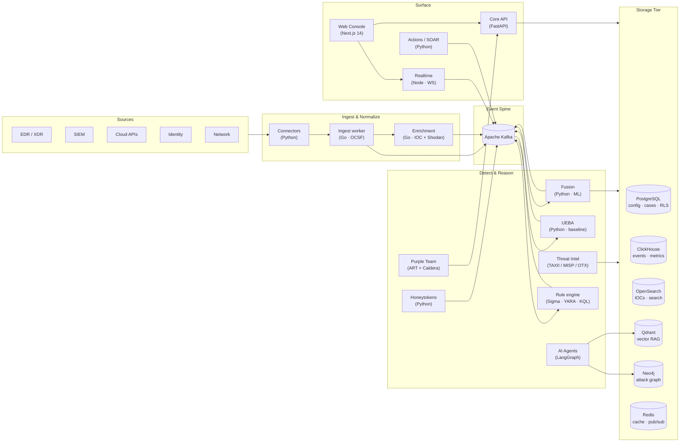

<div align="center">


# AiSOC

### The only AI SOC where the agent is open-source, auditable, and self-hostable.

Every decision the agent makes is **logged step-by-step, queryable, and replayable**. Your data never leaves your infrastructure. MIT-licensed.

[](https://opensource.org/licenses/MIT)
[](apps/docs/docs/benchmark.md)
[](https://cyble.com)
[](CONTRIBUTING.md)
[](#-changelog)

[**Live demo**](https://demo.aisoc.dev) · [**How we compare**](#-how-aisoc-compares) · [**Public benchmark**](apps/docs/docs/benchmark.md) · [**Deploy in one click**](#-deploy-in-one-click) · [**Architecture**](#-architecture) · [**Docs**](apps/docs/)

<br/>

[](https://demo.aisoc.dev/cases/INC-001?tab=ledger)

<sub>Read-only · resets daily at 00:00&nbsp;UTC · lands on a live agent investigation. To run AiSOC on your own data, [self-host in 5 minutes](#-quick-start) or [deploy in one click](#-deploy-in-one-click).</sub>

</div>

---

## 🛡️ Why this matters to a CISO

A CISO at a regulated bank can deploy AiSOC. They cannot deploy a vendor whose agent is a black-box cloud service. AiSOC is the AI SOC your auditor will actually approve, because:

1. **Every agent decision is on the record.** The Investigation Ledger logs the literal LLM prompt, the response, the evidence cited, and the downstream tool calls — for every step of every run. Replay it months later. Hand it to your auditor.
2. **The benchmarks are public, reproducible, and run in CI.** We publish MITRE ATT&CK accuracy, alert reduction, investigation completeness, and response quality numbers — and the harness is one command away. See the [public benchmark](apps/docs/docs/benchmark.md).
3. **It runs entirely on your infrastructure.** No callbacks to a vendor cloud. No data exfil for "model improvement." MIT-licensed end-to-end.
4. **You can fork the agent itself.** The orchestrator is a 600-line LangGraph in [`services/agents/`](services/agents/). Read it. Patch it. Replace the model. Keep the SIEM.

---

## 📊 How AiSOC compares

| Capability | **AiSOC** | Wazuh | Splunk ES | Anvilogic | Prophet Security |
|---|---|---|---|---|---|
| Open-source license | ✅ MIT | ✅ GPL-2 | ❌ proprietary | ❌ proprietary | ❌ proprietary |
| Self-hostable | ✅ | ✅ | ⚠️ enterprise-only | ❌ cloud-only | ❌ cloud-only |
| Autonomous AI investigation | ✅ LangGraph | ❌ | ⚠️ partial (Splunk AI) | ✅ | ✅ |
| **Agent decision audit trail** | ✅ public Investigation Ledger | n/a | n/a | ❌ black box | ❌ black box |
| **Public MITRE accuracy benchmark** | ✅ in CI, reproducible | n/a | n/a | ❌ unpublished | ❌ unpublished |
| Detection content | 200+ Sigma rules | 1,200+ rules | 1,000+ apps | curated | curated |
| Plugin SDK | ✅ Py / TS / Go | ⚠️ YAML rules only | apps | proprietary | proprietary |
| Data residency | 100% your infra | 100% your infra | partial | vendor cloud | vendor cloud |
| Pricing | $0 (you self-host) | $0 (you self-host) | $$ per ingest GB | $$$ enterprise | $$$ enterprise |

The closed-source AI SOC vendors (Anvilogic, Prophet, Tines, Dropzone) ship excellent products. AiSOC is the only stack where the agent itself is open, the decisions are auditable, and the benchmark numbers are public. That is the structural moat.

---

## 🚀 Deploy in one click

Every deploy target ships with a tested config in [`infra/`](infra/). Pick the platform that matches your operational posture:

| Platform | Status | Config | One-click |
|---|---|---|---|
| **Fly.io** (recommended for demo / staging) | ✅ first-class | [`infra/fly/`](infra/fly/) | [Deploy stack](infra/fly/README.md) — 4 apps, ~$14/mo |
| **Render** (managed, sleep-on-idle for hobbyists) | ✅ supported | [`infra/render/render.yaml`](infra/render/render.yaml) | [](https://render.com/deploy?repo=https://github.com/beenuar/AiSOC) |
| **Railway** (PaaS, pay-as-you-go) | ✅ supported | [`infra/railway/railway.toml`](infra/railway/railway.toml) | [](https://railway.com/new/template?template=https%3A%2F%2Fgithub.com%2Fbeenuar%2FAiSOC&plugins=postgresql%2Credis) |
| **Coolify** (your own VPS, free) | ✅ supported | [`docker-compose.yml`](docker-compose.yml) | [Coolify quickstart](infra/coolify/README.md) |
| **Kubernetes / Helm** (production) | ✅ first-class | [`infra/helm/`](infra/helm/) | `helm install aisoc ./infra/helm/aisoc` |
| **AWS / Terraform** (production) | ✅ first-class | [`infra/terraform/`](infra/terraform/) | `cd infra/terraform && terraform apply` |

> 💡 The Render/Railway/Coolify configs deploy the **lean demo profile**: api + agents + web + realtime + Postgres + Redis. ClickHouse, Kafka, OpenSearch, Neo4j, and Qdrant are optional and gated behind compose profiles. For a production-grade install with the full storage tier, use Helm or Terraform.

---

## 🤝 Use it from Claude, Cursor, or Cody

AiSOC ships a first-class **[MCP server](https://modelcontextprotocol.io)** so analysts can query alerts, run agent investigations, and **replay every step the agent took** without leaving the IDE or chat. One command wires up the connection:

```bash
# Claude Desktop / Cursor / Continue / Cody
npx -y @aisoc/mcp install --host claude \
  --aisoc-url https://aisoc.your-company.com \
  --api-key  aisoc_pat_xxxxxxxxxxxx
```

The server exposes 11 tools — discovery (`aisoc_list_alerts`, `aisoc_list_cases`, `aisoc_query_detections`), deep-dive (`aisoc_get_case`, `aisoc_get_investigation`), and the action/replay set (`aisoc_run_investigation`, `aisoc_replay_decision`, `aisoc_explain_step`) that lets the assistant walk the agent decision ledger step-by-step.

📖 Full guide: [docs/integrations/mcp](apps/docs/docs/integrations/mcp.md) · package source: [`services/mcp/`](services/mcp/) · npm: `@aisoc/mcp`

---

## ✨ What's in the box

Modern SOCs drown in alerts and pivot across a dozen consoles. AiSOC is a **single, opinionated stack** that:

- **Ingests** events from any connector (CrowdStrike, Splunk, AWS, Okta, Sentinel) into a Kafka spine.
- **Correlates** them in real time with deduplication, ML scoring, and Sigma/YARA detection.
- **Enriches** every signal with threat-intel from TAXII 2.1, MISP, OTX, and CISA KEV.
- **Reasons** about attacks via a LangGraph multi-agent system grounded in MITRE ATT&CK.
- **Detects deviations** with UEBA — per-user behavioral baselines and Z-score anomaly scoring.
- **Traps adversaries** with cryptographically signed honeytokens (URLs, files, AWS creds, emails).
- **Validates coverage** with automated Atomic Red Team / Caldera adversary emulation.
- **Responds** with blast-radius-aware SOAR actions, every step explainable.
- **Governs** with multi-tenant RLS, granular RBAC, immutable audit logs, and SOC 2 / ISO 27001 / NIST CSF evidence dashboards.

Everything ships under **MIT** — fork it, self-host it, audit it, extend it.

---

## 🚀 Highlights

<table>
<tr>
<td valign="top" width="50%">

### ⚡ Real-time fusion
- Kafka spine with sub-second ingestion
- Bloom-filter dedup on 10M+ IOCs
- LightGBM + Isolation Forest scoring
- Live WebSocket feed into the console

### 🧠 AI Copilot
- LangGraph agents with persistent memory
- Qdrant RAG over MITRE ATT&CK + tenant data
- Natural-language threat hunts
- Every decision traceable end-to-end

### 🕸️ Knowledge graph
- Neo4j entity graph (hosts, users, alerts, IOCs)
- Attack-path reconstruction per case
- Blast-radius gating on automated actions

### 👤 UEBA
- Per-user Welford online baseline (no batch jobs)
- Z-score anomaly scoring with peer-group analysis
- Kafka integration: `security.events` → `security.anomalies`
- Feeds directly into ML fusion scoring

</td>
<td valign="top" width="50%">

### 🎯 Detection engineering
- Sigma over OpenSearch + ClickHouse
- YARA file/memory scanning
- KQL, EQL, Lucene, regex query types
- Community detection catalog with one-click install

### 🍯 Honeytokens
- HMAC-SHA256 signed tokens (URL, file, AWS key, email)
- First-touch webhook alerting
- Token lifecycle: active / triggered / expired
- Built-in lure URL copy & share

### 🟣 Purple Team
- Atomic Red Team YAML parser + Caldera executor
- ATT&CK coverage heatmap (tactic × technique)
- Detection reporting (true positive / false negative)
- Tabletop exercise session manager

### 🛡️ Enterprise governance
- SAML 2.0 + OIDC SSO
- Multi-tenant Postgres RLS
- Granular RBAC (`resource:action` permissions)
- Immutable audit log with tamper-proof trigger
- SOC 2, ISO 27001, NIST CSF, PCI-DSS, HIPAA, DORA dashboards
- MTTD / MTTR / MTTC SLA tracking

</td>
</tr>
</table>

---

## 🏗️ Architecture



### 🔌 Service map

| Service | Lang | Port | Role |
|---|---|---|---|
| `web` | Next.js 14 + React | 3000 | SOC console + marketing landing |
| `api` | Python · FastAPI | 8000 | Alerts, cases, RBAC, graph, rules, audit, compliance |
| `realtime` | Node.js · `ws` | 8086 | Per-channel WebSocket fan-out |
| `agents` | Python · LangGraph | 8001 | Multi-agent reasoning + Qdrant RAG |
| `fusion` | Python | 8003 | Dedup + ML scoring (LightGBM, IsoForest) |
| `actions` | Python | 8002 | SOAR with blast-radius gating |
| `threatintel` | Python | 8005 | TAXII / MISP / OTX / KEV polling |
| `ueba` | Python | 8007 | User & Entity Behavior Analytics |
| `honeytokens` | Python | 8008 | Honeytoken lifecycle + webhook alerting |
| `purple-team` | Python | 8006 | Atomic Red Team + Caldera + ATT&CK heatmap |
| `ingest` | Go | 8081 | OCSF normalization + Shodan/CVE |
| `enrichment` | Go | 8080 | IOC enrichment (VT, AbuseIPDB, GreyNoise) |

### 🗄️ Storage tier

| Store | Purpose |
|---|---|
| **PostgreSQL** | Tenants, users, cases, detection rules, RBAC, audit log, compliance · Row-level security |
| **ClickHouse** | High-cardinality event analytics + alert metrics |
| **OpenSearch** | Full-text IOC + actor + report search · Sigma backend |
| **Qdrant** | Vector RAG for agents, semantic ATT&CK lookup |
| **Neo4j** | Knowledge graph: entities, attack paths, blast radius |
| **Redis** | Cache, pub/sub, IOC bloom filter, enrichment TTL |
| **Kafka** | Event streaming spine (raw, fused, vulnerability, anomaly, action) |

---

## 🖥️ Console tour

The console fuses the analyst's day-zero workflow into one cohesive surface:

- **Dashboard** — live KPI tiles + trend chart + WebSocket-driven event ticker
- **Alerts & Cases** — triage queues, status workflow, evidence timeline
- **Attack Graph** — Cytoscape + fcose layout over the Neo4j subgraph for a case
- **MITRE Heatmap** — coverage tiles with per-tactic technique density
- **Threat Hunting** — Sigma / KQL / YARA editor with on-demand hunts
- **Detection Rules** — Monaco-powered rule builder with Sigma autocompletion
- **Detection Catalog** — community Sigma rules with one-click tenant install
- **Threat Intel** — IOC search, feed status, and STIX/MISP source health
- **Marketplace** — plugin registry with ratings, badges, and category filter
- **Playbooks** — community + private playbooks with SOAR automation
- **UEBA** — behavioral anomaly feed + peer-group deviation chart
- **Honeytokens** — create lures, view trigger log, copy lure URLs
- **Purple Team** — ATT&CK heatmap, execution tracker, tabletop sessions
- **Compliance** — SOC 2 / ISO 27001 / NIST CSF / PCI-DSS / HIPAA / DORA evidence
- **SLA Dashboard** — MTTD, MTTR, MTTC metrics + breach alerts
- **Audit Log** — immutable, paginated, tenant-scoped event history
- **Settings → RBAC** — roles, permissions, and user-role assignments
- **AI Copilot** — slide-over dock invoked with `⌘J` for any page
- **Command palette** — global `⌘K` for navigation, quick actions, and Copilot

> **Marketing landing** lives at `/` and the console at `/dashboard`. Both share the same brand tokens.

---

## 🚀 Quick start

### One-shot demo (under 5 minutes)

If you just want to see AiSOC investigate a real case in your browser:

```bash
git clone https://github.com/beenuar/AiSOC.git
cd AiSOC
pnpm aisoc:demo
```

That single command pulls prebuilt images from `ghcr.io/beenuar/*`, brings up
the slim demo profile (postgres, redis, kafka, api, agents, realtime, web),
seeds canonical demo data, kicks off an AI investigation against a seeded
case, and opens your browser at `/cases/<uuid>` so you land on a live
investigation. Target on a warm Docker daemon:

| Step | Target |
|---|---|
| `docker compose pull` | ~90s |
| `docker compose up` + healthchecks | ~60s |
| Seed canonical data | ~30s |
| Kick off investigation | ~30s |
| **Total time-to-first-investigation** | **~3.5 min** |

When you're done: `pnpm aisoc:demo:down` (deletes the demo volumes).

The full development quick start with all services (UEBA, Honeytokens,
Purple Team, ClickHouse, OpenSearch, Neo4j, Qdrant) is below.

### Full stack (development)

### Prerequisites

- Docker 24+ and Docker Compose v2
- Node.js 20+ and pnpm 8+
- Go 1.21+ and Python 3.11+ (only for local service hacking)

### 1 · Clone

```bash
git clone https://github.com/beenuar/AiSOC.git
cd AiSOC
cp .env.example .env
```

### 2 · Configure

```env
# AI providers (one required)
ANTHROPIC_API_KEY=sk-ant-...
OPENAI_API_KEY=sk-...

# Optional enrichment
CYBLE_API_KEY=...
VIRUSTOTAL_API_KEY=...
ABUSEIPDB_API_KEY=...
GREYNOISE_API_KEY=...
SHODAN_API_KEY=...

# Optional TAXII feeds
TAXII_FEEDS=https://cti-taxii.mitre.org/taxii/,enterprise-attack,,

# Optional SSO (SAML 2.0)
SAML_IDP_METADATA_URL=https://your-idp.example.com/metadata

# Optional SSO (OIDC)
OIDC_DISCOVERY_URL=https://your-idp.example.com/.well-known/openid-configuration
OIDC_CLIENT_ID=aisoc
OIDC_CLIENT_SECRET=...

# Optional Purple Team
CALDERA_URL=http://localhost:8888
CALDERA_API_KEY=...
ATOMIC_RED_TEAM_PATH=/opt/atomic-red-team/atomics
```

### 3 · Boot

```bash
docker compose up -d
docker compose ps
```

First start takes ~60s while datastores warm up.

### 4 · Seed demo data

```bash
pnpm seed:demo            # generates cases, alerts, IOCs, attack paths, UEBA anomalies
```

### 5 · Verify

```bash
pnpm aisoc:doctor         # one-shot health check: ports, containers, demo data, API + WS
```

If anything is red, the doctor tells you exactly what to fix before you log in.

### 6 · Open

| Surface | URL | Notes |
|---|---|---|
| Marketing | http://localhost:3000 | Public landing page |
| Console | http://localhost:3000/dashboard | Default user: `admin@aisoc.local` / `changeme` |
| API (Swagger) | http://localhost:8000/docs | REST + GraphQL endpoints |
| Agents | http://localhost:8001/docs | LangGraph runner |
| UEBA | http://localhost:8007/docs | Behavioral analytics |
| Honeytokens | http://localhost:8008/docs | Honeytoken lifecycle |
| Purple Team | http://localhost:8006/docs | Adversary emulation |
| Realtime WS | ws://localhost:8086/ws/alerts | Live alert channel |
| Neo4j | http://localhost:7474 | `neo4j` / `neo4j_dev_secret` |
| Grafana | http://localhost:3001 | `admin` / `admin` (`monitoring` profile) |
| Jaeger | http://localhost:16686 | Distributed traces (`monitoring` profile) |

### Optional profiles

```bash
docker compose --profile connectors up -d   # CrowdStrike, Splunk, AWS, Okta, Sentinel
docker compose --profile monitoring up -d   # Prometheus, Grafana, Jaeger, OTel Collector
```

---

## 🧩 Monorepo layout

```
AiSOC/
├── apps/
│   ├── web/              # Next.js 14 console + marketing landing
│   └── docs/             # Docusaurus documentation site
├── services/
│   ├── api/              # Core REST API + Neo4j graph + rule engine + auth + RBAC + compliance
│   ├── ingest/           # Go · OCSF normalization · Shodan + CVE
│   ├── enrichment/       # Go · IOC enrichment
│   ├── fusion/           # Python · dedup + ML scoring
│   ├── agents/           # Python · LangGraph + Qdrant RAG
│   ├── actions/          # Python · SOAR + blast-radius gating
│   ├── threatintel/      # Python · TAXII / MISP / OTX / KEV
│   ├── realtime/         # Node.js · per-channel WebSocket fan-out
│   ├── ueba/             # Python · User & Entity Behavior Analytics
│   ├── honeytokens/      # Python · deceptive credential traps
│   └── purple-team/      # Python · Atomic Red Team + Caldera + ATT&CK
├── integrations/         # Connector implementations (CrowdStrike, Splunk, AWS, …)
├── packages/
│   ├── types/            # Shared TS types
│   ├── ui/               # Shared React primitives
│   ├── ocsf/             # OCSF normalization helpers
│   ├── sdk-ts/           # TypeScript SDK for AiSOC API
│   ├── sdk-py/           # Python SDK for AiSOC API
│   ├── sdk-go/           # Go models for AiSOC API
│   ├── plugin-sdk-ts/    # TypeScript plugin development SDK
│   ├── plugin-sdk-py/    # Python plugin development SDK
│   └── aisoc-cli/        # CLI: scaffold / validate / publish plugins & detections
├── detections/           # Community Sigma detection rules (YAML)
├── marketplace/          # Community plugin index (JSON)
├── infra/
│   ├── terraform/        # AWS (VPC, EKS, RDS, ElastiCache, MSK)
│   └── helm/             # Kubernetes Helm chart (HPA, PDB, Ingress per service)
├── docs/
│   ├── openapi.yaml      # OpenAPI 3.1 spec
│   ├── architecture/     # System design docs
│   └── operations/       # Runbooks + multi-region guide
└── scripts/
    ├── backup.sh         # Postgres + ClickHouse + plugins → S3/R2
    ├── restore.sh        # Point-in-time restore
    └── generate_runbook.py  # Auto-generate runbooks from OTel traces
```

---

## 📡 API Reference

The full OpenAPI 3.1 spec lives at [`docs/openapi.yaml`](docs/openapi.yaml). Key endpoint groups:

| Tag | Prefix | Notes |
|---|---|---|
| `auth` | `/api/v1/auth/` | JWT login, SAML ACS, OIDC callback |
| `alerts` | `/api/v1/alerts/` | CRUD, bulk status, timeline |
| `cases` | `/api/v1/cases/` | Create, link alerts, evidence |
| `rules` | `/api/v1/rules/` | Sigma / YARA / KQL CRUD + test |
| `detections` | `/api/v1/detections/` | Catalog browse + install |
| `plugins` | `/api/v1/plugins/` | Registry, publish, rate, approve |
| `playbooks` | `/api/v1/playbooks/` | Community + private playbooks |
| `marketplace` | `/api/v1/marketplace/` | Plugin marketplace with filters |
| `compliance` | `/api/v1/compliance/` | SOC 2 / ISO 27001 / NIST CSF / PCI / HIPAA / DORA |
| `audit` | `/api/v1/audit/` | Immutable audit log, paginated |
| `rbac` | `/api/v1/rbac/` | Roles, permissions, user-role assignments |
| `sla` | `/api/v1/sla/` | MTTD/MTTR/MTTC metrics + breach log |
| `ueba` | `/api/v1/ueba/` | Anomaly feed + baseline stats |
| `honeytokens` | `/api/v1/honeytokens/` | Token lifecycle + trigger events |
| `purple-team` | `/api/v1/purple-team/` | Atomic tests, executions, tabletop sessions |
| `graph` | `/api/v1/graph/` | Neo4j subgraph for a case |
| `intel` | `/api/v1/intel/` | IOC search, feed status |
| `graphql` | `/graphql` | GraphQL schema (alerts, cases, intel) |

Interactive docs: `http://localhost:8000/docs` (Swagger) or `http://localhost:8000/redoc` (ReDoc).

---

## 🧩 Plugin & Detection SDK

Build custom integrations with the AiSOC Plugin SDK:

```bash
# Scaffold a new plugin
npx aisoc-cli scaffold plugin my-connector

# Validate a detection rule
npx aisoc-cli validate detection ./detections/my-rule.yaml

# Publish to community registry (Ed25519 signed)
npx aisoc-cli publish plugin ./my-connector --key ~/.aisoc/signing.key
```

SDKs available for:
- **TypeScript** — `packages/plugin-sdk-ts` (npm: `@aisoc/plugin-sdk`)
- **Python** — `packages/plugin-sdk-py` (PyPI: `aisoc-plugin-sdk`)
- **Go** — `packages/sdk-go` (module: `github.com/cyble/aisoc-sdk-go`)

---

## 👩‍💻 Development

### Frontend

```bash
cd apps/web
pnpm install
pnpm dev
```

### Backend (selective)

```bash
docker compose up -d postgres redis kafka clickhouse opensearch qdrant neo4j

# Core API
cd services/api && poetry install && poetry run uvicorn app.main:app --reload --port 8000

# UEBA
cd services/ueba && poetry install && poetry run uvicorn app.main:app --reload --port 8007

# Honeytokens
cd services/honeytokens && poetry install && poetry run uvicorn app.main:app --reload --port 8008

# Purple Team
cd services/purple-team && poetry install && poetry run uvicorn app.main:app --reload --port 8006

# Fusion
cd services/fusion && poetry install && poetry run uvicorn app.main:app --reload --port 8003

# Go services
cd services/ingest && go run main.go
```

### Database migrations

```bash
# Run all migrations
docker compose exec api alembic upgrade head

# Per-service migrations
cd services/ueba && poetry run alembic upgrade head
cd services/honeytokens && poetry run alembic upgrade head
cd services/purple-team && poetry run alembic upgrade head
```

### Tests

```bash
cd apps/web && pnpm test
cd services/api && poetry run pytest
cd services/ueba && poetry run pytest
cd services/honeytokens && poetry run pytest
cd services/purple-team && poetry run pytest
cd services/ingest && go test ./...
```

---

## ☸️ Deployment

### Kubernetes (recommended)

```bash
helm repo add bitnami https://charts.bitnami.com/bitnami
helm install aisoc ./infra/helm/aisoc \
  --namespace aisoc \
  --create-namespace \
  --values ./infra/helm/aisoc/values.yaml \
  --set global.environment=production
```

The Helm chart includes HPA, PDB, and Ingress for every microservice.

### Backup & restore

```bash
# Backup Postgres + ClickHouse + plugins to S3
./scripts/backup.sh --target s3://my-bucket/aisoc-backups

# Point-in-time restore
./scripts/restore.sh --source s3://my-bucket/aisoc-backups/2026-05-03T10:00:00Z
```

### Multi-region

See [`docs/operations/multi-region.md`](docs/operations/multi-region.md) for active-passive and active-active deployment guides.

### Operational runbooks

```bash
# Auto-generate runbook from live OTel trace data
python scripts/generate_runbook.py --service api --output docs/operations/runbooks/api.md
```

### Terraform on AWS

```bash
cd infra/terraform
terraform init
terraform plan -var="environment=prod"
terraform apply
```

---

## 🔭 Roadmap

We publish the public roadmap in [ROADMAP.md](ROADMAP.md). All v4.1, v5.0, and v5.1 items have shipped. Next up:

- v6.0 — Agent-authored detections with human-in-the-loop review
- v6.1 — Federated threat intel sharing across self-hosted instances
- v6.2 — Multi-region active-active with CRDTs for case sync

---

## 🤝 Contributing

We welcome PRs of every size. Read [CONTRIBUTING.md](CONTRIBUTING.md) for the workflow and the [Code of Conduct](CODE_OF_CONDUCT.md) before opening a PR.

Good first issues:

- Adding new connector integrations in `integrations/`
- Expanding community Sigma detections in `detections/`
- Building new plugins and publishing to the marketplace
- Frontend UI polish (Tailwind / React)
- Documentation and tutorials in `apps/docs/`
- Test coverage for any service
- Translations

---

## 🔐 Security

Found a security issue? Please **do not** open a public issue. Email `security@cyble.com` (PGP key in [SECURITY.md](SECURITY.md)). We follow coordinated disclosure.

---

## 📜 License

[MIT](LICENSE) — © 2024–present [Cyble Inc.](https://cyble.com)

---

<div align="center">

**Built with ❤️ by [Cyble](https://cyble.com) and the open-source community.**

[Report a bug](https://github.com/beenuar/AiSOC/issues/new?template=bug_report.md) · [Request a feature](https://github.com/beenuar/AiSOC/issues/new?template=feature_request.md) · [Become a contributor](CONTRIBUTING.md) · [Read the docs](apps/docs/)

</div>
