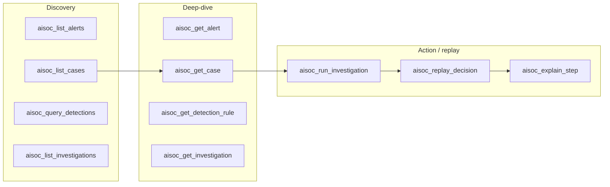

# MCP server

The `@aisoc/mcp` npm package is the official [Model Context Protocol](https://modelcontextprotocol.io) bridge between AiSOC and modern AI assistants. Once installed, your assistant can list alerts, pull cases, run agent investigations, and **replay every step the agent took** — without leaving the chat or the IDE.

> **Why this matters.** MCP is becoming the substrate for "AI tools that work everywhere": Claude Desktop, Cursor, Cody, Continue, Zed, and counting. Every analyst who works in those tools gets AiSOC discovery for free.

## Supported hosts

| Host | One-line install | Config file |
|---|---|---|
| **Claude Desktop** | `npx -y @aisoc/mcp install --host claude --aisoc-url … --api-key …` | `~/Library/Application Support/Claude/claude_desktop_config.json` |
| **Cursor** | `npx -y @aisoc/mcp install --host cursor --aisoc-url … --api-key …` | `~/.cursor/mcp.json` |
| **Continue.dev** | `npx -y @aisoc/mcp install --host continue --aisoc-url … --api-key …` | `~/.continue/config.json` |
| **Cody** | `npx -y @aisoc/mcp install --host cody --aisoc-url … --api-key …` (prints snippet) | VS Code User Settings → `cody.mcp.servers` |

Print the canonical config paths for your machine any time:

```bash
npx -y @aisoc/mcp install --list-paths
```

## 60-second quickstart

### 1. Mint an API key

In the AiSOC console: **Settings → API Keys → New personal access token**. Give it `cases:read`, `alerts:read`, `detections:read`, and (if you want the agent to investigate from chat) `cases:investigate`. Copy the token — it's shown once.

### 2. Run the installer

```bash
npx -y @aisoc/mcp install --host claude \
  --aisoc-url https://aisoc.your-company.com \
  --api-key  aisoc_pat_xxxxxxxxxxxx
```

The installer is **idempotent**. Re-running it with the same arguments is a no-op; re-running it with a new URL or key updates the entry in place.

### 3. Restart your assistant

- **Claude Desktop**: `Cmd+Q` then reopen.
- **Cursor**: open Settings → MCP and confirm the `aisoc` server shows green.
- **Continue.dev**: `Cmd/Ctrl+Shift+P` → _Continue: Reload Window_.

### 4. Try it

Ask your assistant:

> _"Show me the open P0 cases in AiSOC."_
>
> _"Replay the agent's reasoning on case INC-0421 step by step."_
>
> _"Why did the agent decide that 10.0.42.7 was malicious in run 7c1f…?"_

If the assistant asks for permission to call `aisoc_*` tools, that's expected — every host requires explicit approval the first time.

## Tools exposed

The server advertises **11 tools** to your assistant. Discovery tools list things, deep-dive tools fetch one thing, and the action / replay tools are what make AiSOC interesting:



| Tool | What it does |
|---|---|
| `aisoc_list_alerts` | Page through alerts with filters (severity, status, time range). |
| `aisoc_get_alert` | Full alert detail including enrichments and matched detections. |
| `aisoc_list_cases` | Page through cases with filters (status, owner, priority). |
| `aisoc_get_case` | Full case detail including timeline and linked alerts. |
| `aisoc_query_detections` | Search detection rules by name, MITRE technique, or tag. |
| `aisoc_get_detection_rule` | Inspect a single rule (logic, fixtures, FP notes). |
| `aisoc_list_investigations` | Page through agent investigation runs. |
| `aisoc_get_investigation` | Run summary (status, duration, agents involved, cost). |
| **`aisoc_run_investigation`** | Kick off the agent on a case and stream events back. |
| **`aisoc_replay_decision`** | Walk the agent ledger step-by-step (recon, forensic, responder, reporter). |
| **`aisoc_explain_step`** | Why-did-the-agent-do-this for a single step: prompt, response, tool I/O. |

The replay/explain pair is the moat: closed-source AI SOC vendors can't show you their agent's prompts and tool calls. AiSOC will.

## Configuration

All flags can be set via env vars; the CLI flag wins if both are present.

| Flag | Env var | Default | Notes |
|---|---|---|---|
| `--aisoc-url` | `AISOC_URL` | `http://localhost:8081` | Base URL of the AiSOC API. |
| `--api-key` | `AISOC_API_KEY` | _(none)_ | API key (`aisoc_pat_…`) or JWT. Required for non-public endpoints. |
| `--timeout` | `AISOC_TIMEOUT_MS` | `20000` | Per-request timeout in ms. |
| `--verbose` | `AISOC_VERBOSE=1` | off | Lifecycle logs to stderr (stdout stays JSON-RPC clean). |

## Manual (no-installer) setup

If you'd rather edit JSON yourself, `install --dry-run` prints exactly what the installer would write:

```bash
npx -y @aisoc/mcp install --host claude --dry-run \
  --aisoc-url https://aisoc.your-company.com --api-key aisoc_xxx
```

Paste the snippet under `mcpServers` in your host's config:

```json
{
  "mcpServers": {
    "aisoc": {
      "command": "npx",
      "args": ["-y", "@aisoc/mcp", "serve"],
      "env": {
        "AISOC_URL": "https://aisoc.your-company.com",
        "AISOC_API_KEY": "aisoc_pat_xxxxxxxxxxxx"
      }
    }
  }
}
```

## Verify before you fly

Before pointing your assistant at it, smoke-test the connection:

```bash
AISOC_URL=https://aisoc.your-company.com \
AISOC_API_KEY=aisoc_pat_xxx \
npx -y @aisoc/mcp doctor
```

`doctor` checks DNS, TLS, the AiSOC `/health` endpoint, and that your API key is accepted. It exits non-zero on failure, so it's safe to wire into a pre-flight script.

## Security model

- **Your API key never leaves the machine** running the server. It's read from env or the host's local config file (mode `0600`) and used to sign requests to your AiSOC instance.
- **Read-only by default** unless your API key has write scopes. `aisoc_run_investigation` requires `cases:investigate`; everything else only needs `cases:read` / `alerts:read`.
- **Audit trail.** Every tool call lands in the AiSOC audit log with the calling user and the tool name. You can revoke the key and replay every action it took.
- **No telemetry.** This package makes exactly two outbound destinations: your AiSOC URL, and the npm registry on `npx` cold-start.

## Troubleshooting

**The server doesn't appear in my assistant.** Restart the host fully (Claude Desktop: `Cmd+Q`, not just close the window). Then re-run `install --list-paths` and confirm the config file at the printed path actually contains an `aisoc` entry under `mcpServers`.

**Tools fail with 401 / 403.** Re-mint the API key with the right scopes and re-run the installer; it will update the entry in place. Confirm with `npx -y @aisoc/mcp doctor`.

**Tools fail with "fetch failed" / timeouts.** Your assistant's host can't reach `AISOC_URL`. Check that the URL is reachable from the same machine (`curl $AISOC_URL/health`) and bump `--timeout 60000` if you're on a slow link.

**The config file is malformed.** The installer refuses to overwrite a config it can't parse, to avoid clobbering hand-edits. Fix or back up the file, then re-run.

## Source & contributions

The package source lives in [`services/mcp`](https://github.com/beenuar/AiSOC/tree/main/services/mcp). Tests, tool definitions, and the installer are all there. PRs welcome — the contract tests in [`tests/tools.test.ts`](https://github.com/beenuar/AiSOC/blob/main/services/mcp/tests/tools.test.ts) will tell you immediately if you forget metadata, ordering, or naming conventions on a new tool.
